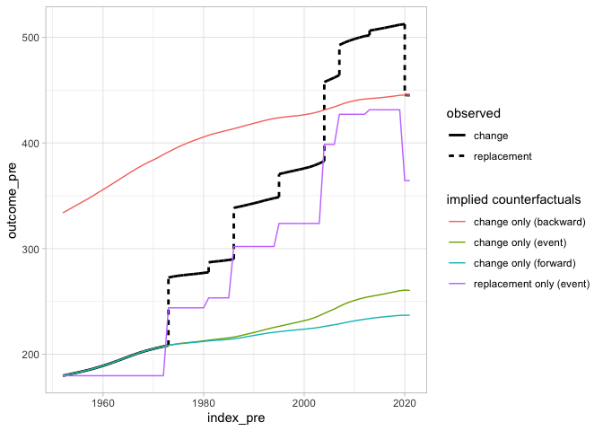

<!-- README.md is generated from README.Rmd. Please edit that file -->

# socialchange

<!-- badges: start -->

<!-- badges: end -->

The goal of socialchange is to …

## Installation

You can install the development version of socialchange from
[GitHub](https://github.com/) with:

``` r
# install.packages("pak")
pak::pak("elbersb/socialchange")
```

## Example

As a basic example, we look at a decomposition of EU membership, and
whether population growth in the EU is due to intracountry changes in
population, or due to the admission of new countries. The decomposition
unit is the country. To run the `event_decomposition` decomposition
function, we need two datasets: One dataset contains the events, in this
case the dates when countries entered or exited the EU. This dataset is
included in the `socialchange` package:

``` r
library(socialchange)
socialchange::eu_membership
#>           country       date event_type
#> 1         Belgium 1952-07-23    initial
#> 2          France 1952-07-23    initial
#> 3         Germany 1952-07-23    initial
#> 4           Italy 1952-07-23    initial
#> 5      Luxembourg 1952-07-23    initial
#> 6     Netherlands 1952-07-23    initial
#> 7  United Kingdom 1973-01-01      entry
#> 8         Denmark 1973-01-01      entry
#> 9         Ireland 1973-01-01      entry
#> 10         Greece 1981-01-01      entry
#> 11       Portugal 1986-01-01      entry
#> 12          Spain 1986-01-01      entry
#> 13        Austria 1995-01-01      entry
#> 14         Sweden 1995-01-01      entry
#> 15        Finland 1995-01-01      entry
#> 16         Cyprus 2004-05-01      entry
#> 17          Malta 2004-05-01      entry
#> 18        Hungary 2004-05-01      entry
#> 19         Poland 2004-05-01      entry
#> 20       Slovakia 2004-05-01      entry
#> 21         Latvia 2004-05-01      entry
#> 22        Estonia 2004-05-01      entry
#> 23      Lithuania 2004-05-01      entry
#> 24        Czechia 2004-05-01      entry
#> 25       Slovenia 2004-05-01      entry
#> 26       Bulgaria 2007-01-01      entry
#> 27        Romania 2007-01-01      entry
#> 28        Croatia 2013-07-01      entry
#> 29 United Kingdom 2020-01-31       exit
```

The second dataset contains the outcome that we want to decompose at any
point in time where there are change events, plus the start and end
period of interest. The EU was formed in 1952, and then countries
entered or exited in 1973, 1981, 1986, 1995, 2004, 2007, 2013, and 2020.
Countries, of course, entered on specific dates, but most population
data is only provided at yearly resolutions, so we assume that the error
introduced by using a yearly resolution is small. The `socialchange`
package also includes total population data for all countries of the
world from 1950 onwards, so it also includes the required data:

``` r
library(data.table)
wpp_data <- as.data.table(socialchange::wpp_data)
# population data is in 1,000
wpp_data[Location == "Belgium" & Time %in% c(1952, 1973, 1981, 1986, 1995, 2004, 2007, 2013, 2020)]
#>    Location  Time  PopTotal
#>      <char> <num>     <num>
#> 1:  Belgium  1952  8695.582
#> 2:  Belgium  1973  9727.980
#> 3:  Belgium  1981  9843.592
#> 4:  Belgium  1986  9887.815
#> 5:  Belgium  1995 10095.198
#> 6:  Belgium  2004 10456.163
#> 7:  Belgium  2007 10653.697
#> 8:  Belgium  2013 11103.257
#> 9:  Belgium  2020 11561.717
```

To run the `event_decomposition` function, we need to ensure that
columns for the unit and time parameters are named the same, so we
prepare the data as follows:

``` r
# rename columns
setnames(wpp_data, c("Location", "Time"), c("country", "year"))
# population in millions
wpp_data[, PopTotal := PopTotal / 1000]

# coarsen to year - required as we don't have daily population data
eu_membership <- as.data.table(socialchange::eu_membership)
eu_membership[, year := year(as.Date(date))]
```

Finally, we run the decomposition. We specify the two datasets, and a
formula of the form `Outcome ~ Unit + Time`. We also need to specify the
end data, and an aggregation function. Often this will be mean, but in
our case it needs to be `sum`:

``` r
ev <- event_decomposition(eu_membership, wpp_data, PopTotal ~ country + year,
  end_period = 2021, fun = sum)
print(ev)
#>     event_type      term    total      pct
#>         <char>     <num>    <num>    <num>
#> 1:      change  80.74284 265.3265 30.43151
#> 2: replacement 184.58363 265.3265 69.56849
```

The outcome of the decomposition tells us that intracountry changes in
population account for 30% of the total population increase (or 80
million), while additions and one (Br)exit account for 70% of the total
population increase (or 184 million).

It is also possible to produce a figure that shows the decomposition:

``` r
plot(ev)
#> Warning: Using `size` aesthetic for lines was deprecated in ggplot2 3.4.0.
#> ℹ Please use `linewidth` instead.
#> ℹ The deprecated feature was likely used in the socialchange package.
#>   Please report the issue to the authors.
#> This warning is displayed once per session.
#> Call `lifecycle::last_lifecycle_warnings()` to see where this warning was generated.
```


