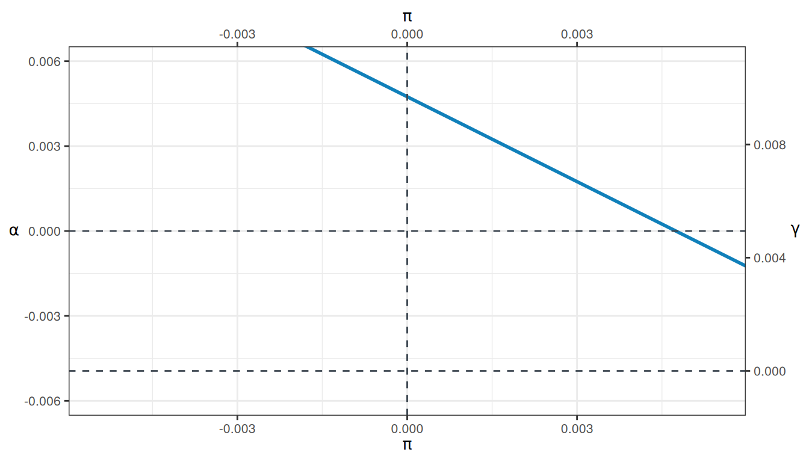
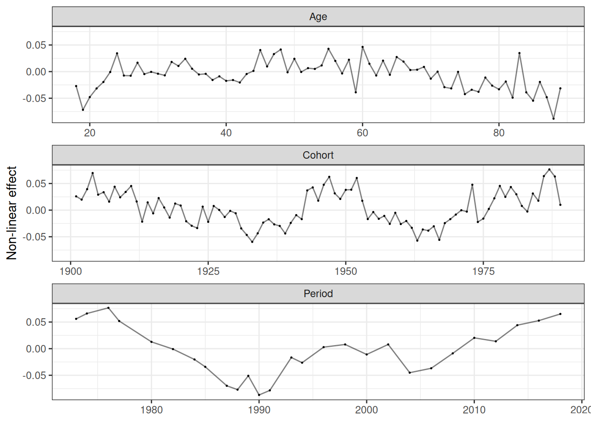
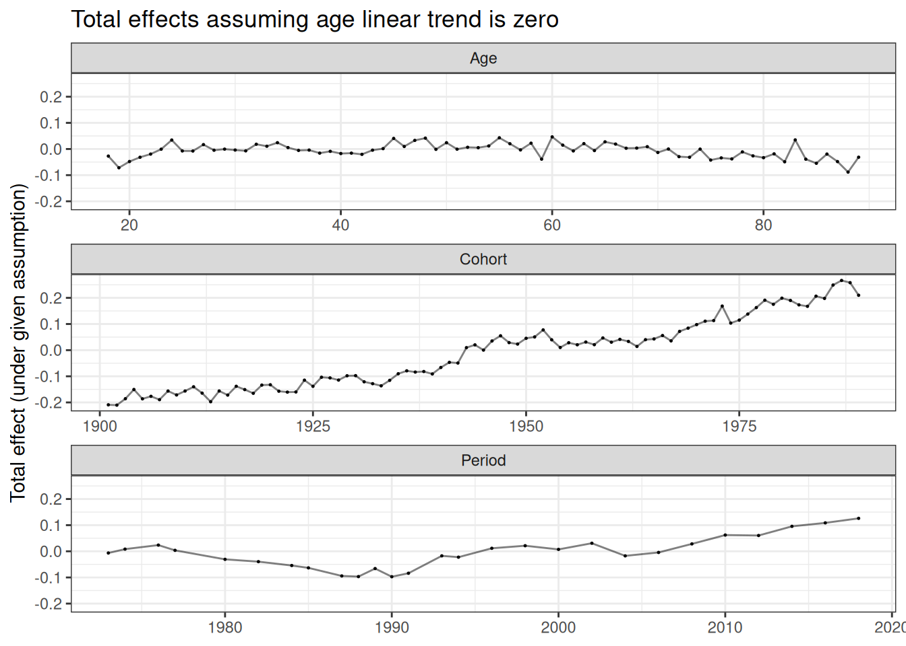
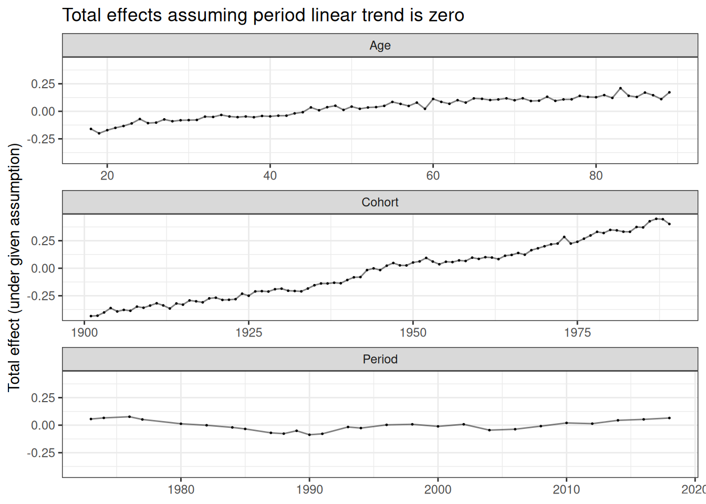
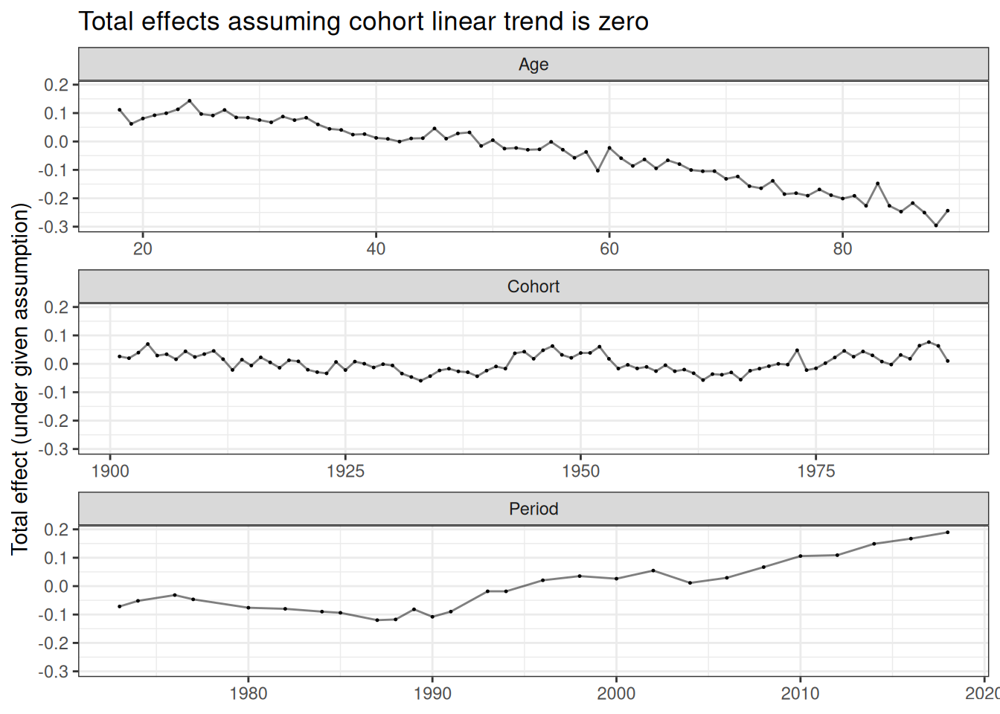

# APC Models

For research purposes, this package also implements some methods on APC
analysis. We use the `gss_homosex` dataset for these examples. For a
CR-IC decomposition of the same dataset comparing intracohort change and
cohort replacement, see the [GSS homosexuality
vignette](https://elbersb.github.io/socialchange/articles/gss_homosexuality.md).

## Fosse & Winship 2D-APC graph

``` r

library("socialchange")
library("ggplot2")

apc_model <- apc(gss_homosex[cohort < 1990 & cohort > 1900], homosex ~ age + year + cohort)
apc_plot_two2d(apc_model)
```



## Identifying the non-linearities

Formal analysis of the non-linearities:

``` r

apc_plot_nonlinearities(apc_model)
```



## APC effects under different assumptions

``` r

apc_plot_total(apc_model, list("age_linear" = 0)) +
    ggtitle("Total effects assuming age linear trend is zero")
```



``` r


apc_plot_total(apc_model, list("period_linear" = 0)) +
    ggtitle("Total effects assuming period linear trend is zero")
```



``` r


apc_plot_total(apc_model, list("cohort_linear" = 0)) +
    ggtitle("Total effects assuming cohort linear trend is zero")
```


