# Decomposing General Social Survey data: Attitudes on Homosexuality

The package includes a dataset `gss_homosex`, covering General Social
Survey data on attitudes towards homosexuality in the U.S. This data was
also analyzed in Ekstam (2021).

## Packages

``` r

library("socialchange")
library("modelsummary")
library("ggplot2")
library("mgcv")

data(gss_homosex)
```

## Descriptives

The `homosex` outcome is rescaled to \[0, 1\], where 0 means “always
wrong” and 1 means “not wrong at all”. The table below gives summary
statistics; the line plot shows a clear upward trend in acceptance over
the survey period.

``` r

# compare to Table 1 in Ekstam -- roughly similar
modelsummary::datasummary(
  homosex + year + cohort + age + educ ~ mean + SD + min + max,
  data = gss_homosex, output = "markdown", fmt = 3)
```

|                                  | mean     | SD     | min      | max      |
|----------------------------------|----------|--------|----------|----------|
| homosexual sex relations         | 0.315    | 0.436  | 0.000    | 1.000    |
| gss year for this respondent     | 1993.803 | 12.928 | 1973.000 | 2016.000 |
| cohort                           | 1947.852 | 20.826 | 1892.000 | 1995.000 |
| age of respondent                | 45.950   | 17.485 | 18.000   | 89.000   |
| highest year of school completed | 12.835   | 3.171  | 0.000    | 20.000   |

``` r


# sex and race are categorical, so show their level breakdown instead
modelsummary::datasummary(
  sex + race ~ N + Percent(),
  data = gss_homosex, output = "markdown", fmt = 1)
```

|      |        | N     | Percent |
|------|--------|-------|---------|
| sex  | female | 19403 | 55.3    |
|      | male   | 15703 | 44.7    |
| race | black  | 4460  | 12.7    |
|      | other  | 1836  | 5.2     |
|      | white  | 28810 | 82.1    |

``` r


by_year <- gss_homosex[, list(y = weighted.mean(homosex, wtssall)), by = c("year")]
ggplot(by_year, aes(x = year, y = y)) + geom_line() + ylim(0, 1) + theme_light()
```

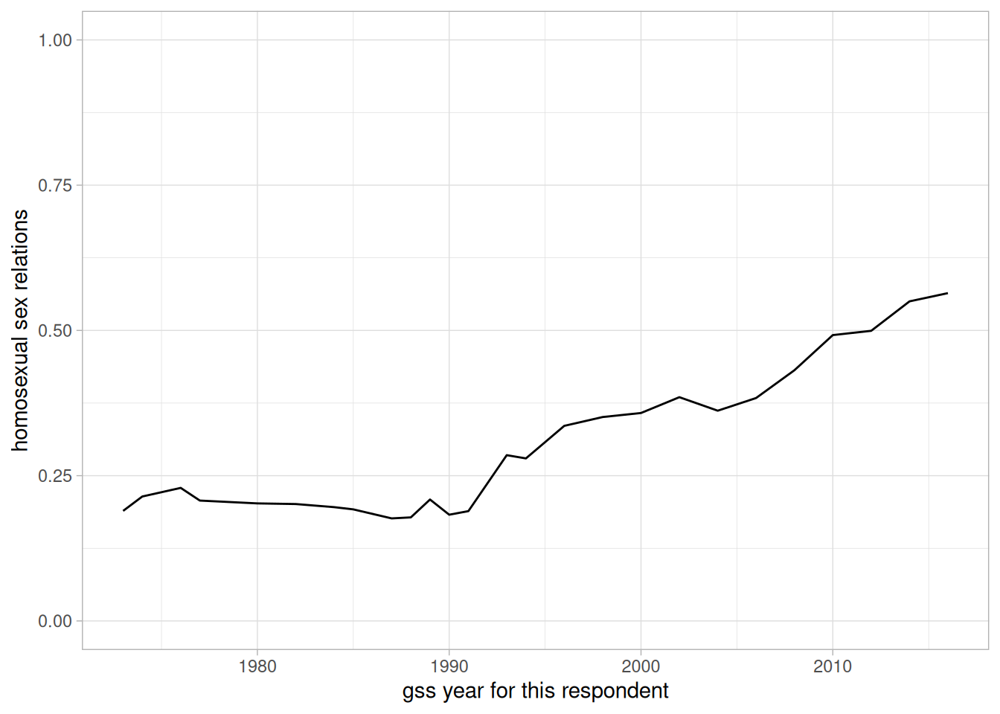

To separate period and cohort effects, we fit a GAM with a
two-dimensional smooth over survey year and birth cohort. The 3D surface
and the contour plot below both shows that acceptance increased more
strongly among younger cohorts and in later periods.

``` r

splinemodel = gam(homosex ~ s(year, cohort), data = gss_homosex)
vis.gam(splinemodel, theta = 40)
```

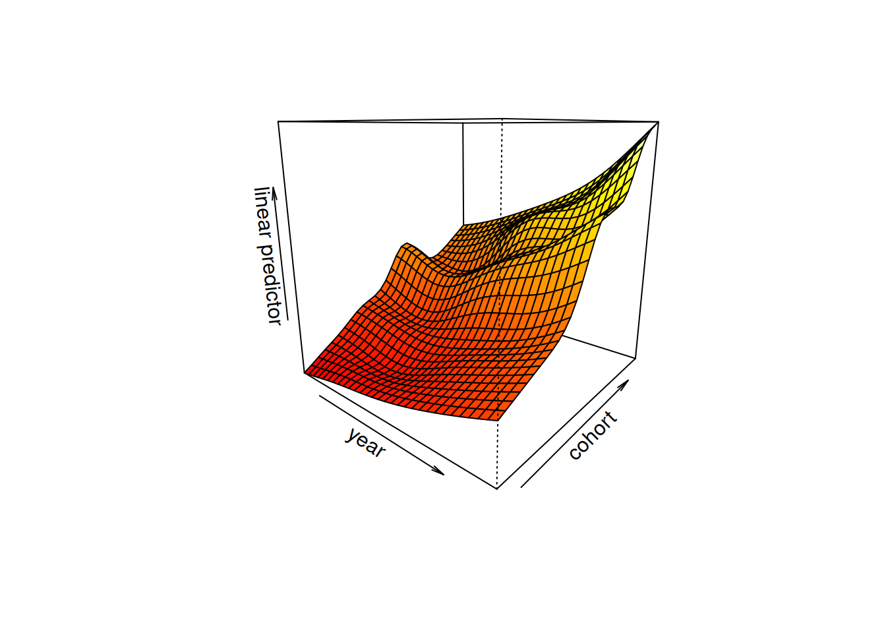

``` r

plot_gam_surface(splinemodel)
```

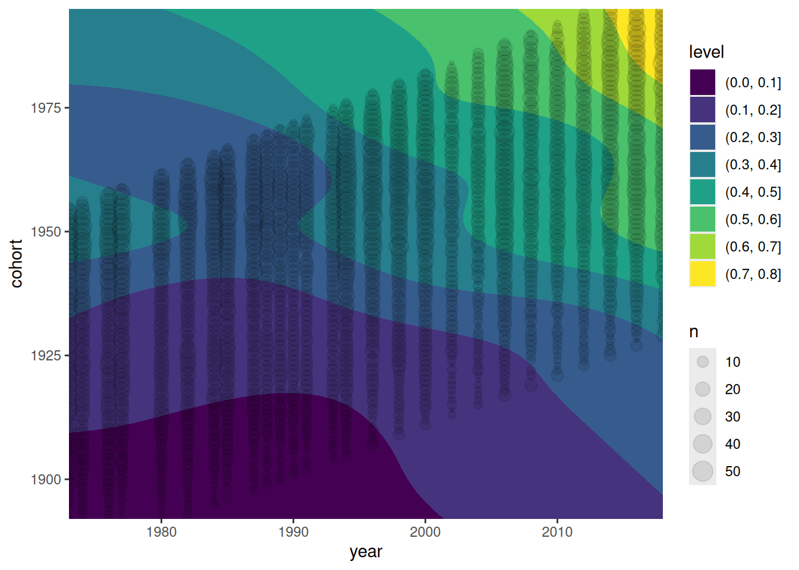

## CR-IC decomposition

The
[`cr_ic()`](https://elbersb.github.io/socialchange/reference/cr_ic.md)
function implements four methods for separating intracohort change (IC)
from cohort replacement (CR): algebraic decomposition (AD), linear
decomposition (LD), and two model-based improvements (AD+ and Model).
For a detailed explanation of each method, including a replication of
Firebaugh (1989), see the [Replications:
Firebaugh](https://elbersb.github.io/socialchange/articles/replicating_firebaugh.md)
vignette.

Acceptance rose by about 43 percentage points between 1973 and 2018
(from 0.19 to 0.62). Using the full panel, the two model-based methods
both attribute the larger share to intracohort change, though they
differ on the exact split: AD+ gives roughly 63% intracohort change and
37% cohort replacement, while the Model method gives roughly 56% and
44%.

``` r

# complete period
form <- homosex ~ as.factor(year) + as.factor(cohort)
(res <- cr_ic(gss_homosex, homosex ~ year + cohort, weight = "wtssall", model = form))
#> Cohort decomposition (year-over-year) with 26 periods:
#>    1973, 1974, 1976, 1977, 1980, 1982, 1984, 1985, 1987, 1988, 1989, 1990, 1991, 1993, 1994, 1996, 1998, 2000, 2002, 2004, 2006, 2008, 2010, 2012, 2014, 2016
#> 
#> Summary for entire period:
#>       1973      2016 Difference
#>      <num>     <num>      <num>
#>  0.1893911 0.5642217  0.3748306
#> 
#> Decompositions:
#>  method factor     value         %
#>  <char> <char>     <num>     <num>
#>      LD  total 0.3748306 100.00000
#>      LD     IC 0.2062929  55.03632
#>      LD     CR 0.1685376  44.96368
#>      LD  resid 0.0000000        NA
#>      AD  total 0.3748306 100.00000
#>      AD     IC 0.2422175  64.62053
#>      AD     CR 0.1326131  35.37947
#>      AD  resid 0.0000000        NA
#>     AD+  total 0.3748306 100.00000
#>     AD+     IC 0.2379691  63.48710
#>     AD+     CR 0.1368615  36.51290
#>     AD+  resid 0.0000000        NA
#>   Model  total 0.3748306 100.00000
#>   Model     IC 0.2047557  54.62619
#>   Model     CR 0.1700749  45.37381
#>   Model  resid 0.0000000        NA
```

``` r

plot(res)
```

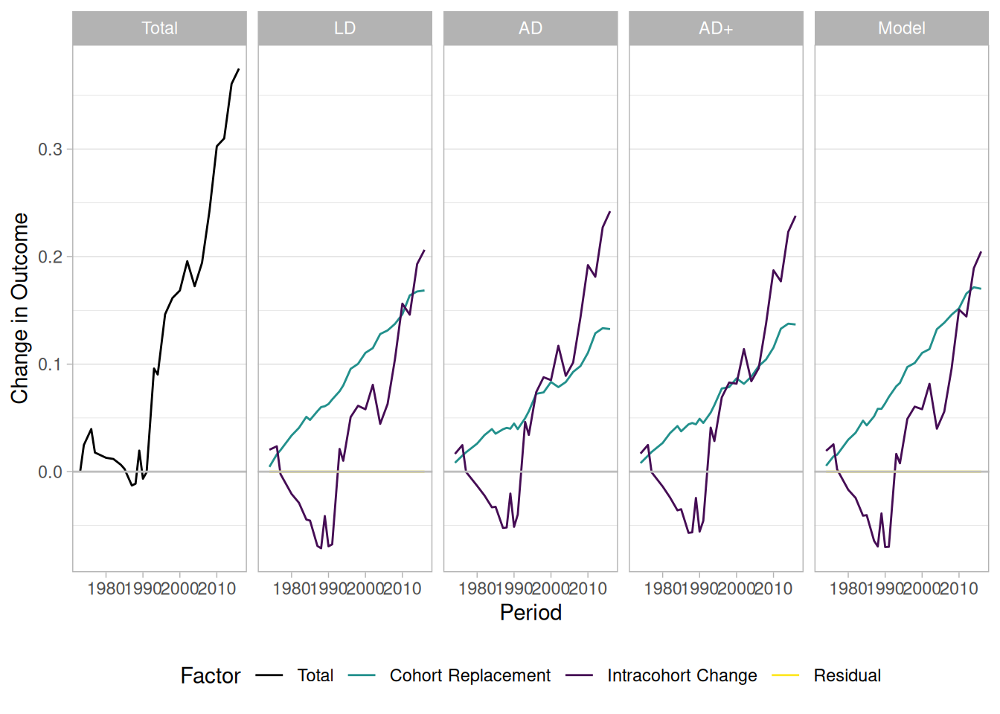

When only the first and last survey years are used, the balance shifts
slightly toward cohort replacement (~54% CR, ~46% IC). This illustrates
how the choice of time points can affect decomposition results, and why
the model-based AD+ and Model methods are preferred over the simpler AD.

``` r

# only beginning and end year (also compare to Baunach 2011)
form <- homosex ~ as.factor(year) + splines::bs(cohort, 10)
(res <- cr_ic(gss_homosex[year %in% c(min(year), max(year))], homosex ~ year + cohort, weight = "wtssall", model = form))
#> Cohort decomposition (year-over-year) with 2 periods:
#>    1973, 2016
#> 
#> Summary for entire period:
#>       1973      2016 Difference
#>      <num>     <num>      <num>
#>  0.1893911 0.5642217  0.3748306
#> 
#> Decompositions:
#>  method factor     value         %
#>  <char> <char>     <num>     <num>
#>      LD  total 0.3748306 100.00000
#>      LD     IC 0.1549435  41.33694
#>      LD     CR 0.2198871  58.66306
#>      LD  resid 0.0000000        NA
#>      AD  total 0.3748306 100.00000
#>      AD     IC 0.0764078  20.38462
#>      AD     CR 0.2984228  79.61538
#>      AD  resid 0.0000000        NA
#>     AD+  total 0.3748306 100.00000
#>     AD+     IC 0.1923286  51.31080
#>     AD+     CR 0.1825020  48.68920
#>     AD+  resid 0.0000000        NA
#>   Model  total 0.3748306 100.00000
#>   Model     IC 0.1961770  52.33750
#>   Model     CR 0.1786536  47.66250
#>   Model  resid 0.0000000        NA
```

## Event-based decomposition

The
[`decompose_aggregated()`](https://elbersb.github.io/socialchange/reference/decompose_aggregated.md)
function separates change in the aggregate outcome into intraindividual
change (attitude shifts within respondents already in the population)
and population turnover (mortality and coming-of-age effects). We rename
`year` and `homosex` to the column names the function expects, then pass
the full dataset directly.

``` r

# decompose_aggregated() requires every wave to share a common minimum age. The
# 2014 and 2016 waves sampled no one under 19 and 21 respectively, so we restrict
# to age >= 21 to give all waves the same minimum age.
gss_all <- gss_homosex[age >= 21, .(age, period = year, sex, y = homosex, wtssall)]
```

We fit a GAM to the individual responses to model acceptance as a smooth
function of age and period.

``` r

set.seed(42)
model <- mgcv::gam(y ~ s(age) + s(period), data = gss_all, weights = wtssall)
```

### The simplest decomposition

We can run the simplest case of the event decomposition with the
following commmand:

``` r

result <- decompose_aggregated(gss_all, model, weight = "wtssall")
print(result, detailed = FALSE)
#>                 Component    Value Percent
#>  At initial (modeled)      0.19739        
#>  At end (modeled)          0.56751        
#>  Total change              0.37013   100.0
#>  - Intraindividual change  0.19236   52.0 
#>  - Population turnover     0.17777   48.0 
#>    - Mortality             0.09952   26.9 
#>    - Coming-of-age         0.10298   27.8 
#>    - In-migration         -0.02472   -6.7
```

This decomposition compares cells across years, attributing shrinking
cohorts to mortality and the youngest cohorts to coming-of-age. Every
change in a cell’s size must be attributed to *some* demographic event —
the decomposition never leaves a residual — so a survivor cohort that
*grows* between two waves is credited to net in-migration. With only the
survey to work from, this in-migration term (about −0.025, or −7% of the
total change) largely reflects sampling fluctuation in cell sizes across
waves rather than genuine immigration. It becomes meaningful only once a
true population frame is supplied (see below), where a growing cohort
really does signal net immigration.

Of the roughly 37 percentage point rise in acceptance between 1973 and
2016, the decomposition attributes about 52% to intraindividual change
and 48% to population turnover (mortality of older, less accepting
cohorts; coming-of-age of younger, more accepting ones; and a small net
in-migration term). This is close to, though slightly above, the range
spanned by the CR-IC model-based methods above (37–44% turnover).

``` r

plot(result)
```

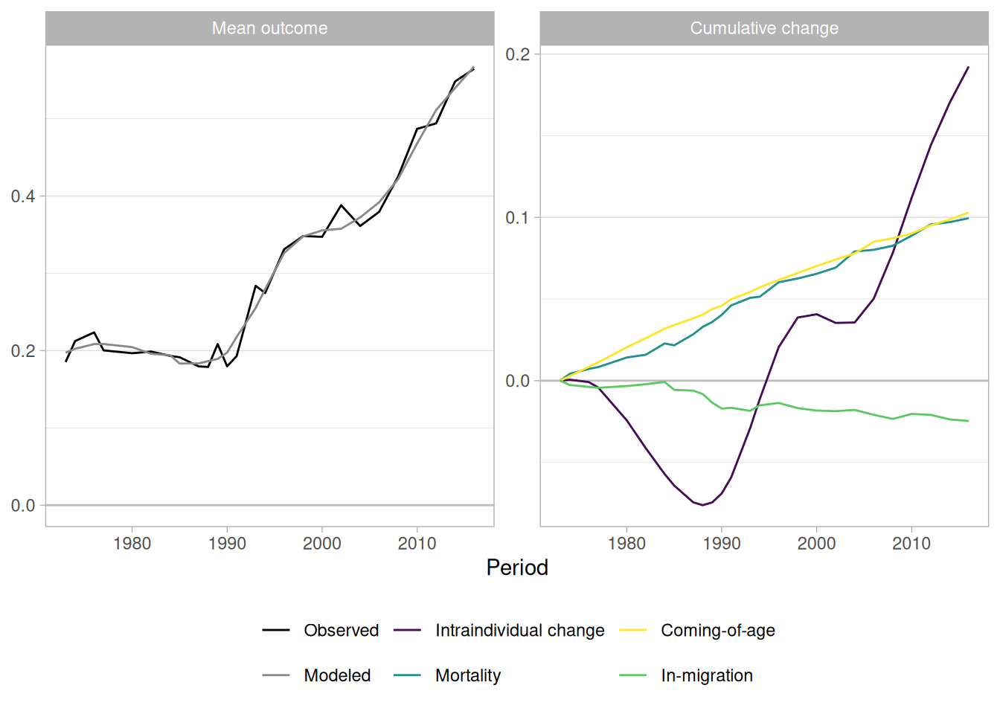

What is most interesting about these results is how the components
behave over time. Until the early-to-mid 1990s, intraindividual change
and population turnover offset each other, leaving the aggregate mean
roughly flat. The mean even dipped in the mid-1980s, falling from about
0.21 in 1977 to 0.18 in 1987, as the existing members of the population
became less accepting of homosexuality. Turnover pulled the mean back up
over the same period, so that by the early 1990s acceptance had barely
moved from its 1973 level. Only from the mid-1990s did intraindividual
change start to contribute toward acceptance, and from that point on it
became the main driver of the rising trend. Turnover contributed in the
positive direction throughout. Mortality of older, less accepting
cohorts had a much stronger effect than the coming-of-age of younger
ones, likely because new members of the population are already closer to
the population mean.

One speculative reading of the early decline in intraindividual
acceptance is the backlash associated with the AIDS epidemic of the
1980s. The decomposition itself cannot establish this, but it does
isolate a within-person decline that is invisible in the raw trend line.

### Adding a covariate

We can split the population into covariate cells with the `cells`
argument. Adding `sex` lets the outcome model predict differently for
men and women, and — more consequentially for the decomposition —
derives the demographic events (mortality, coming-of-age, migration)
separately within each sex cell rather than from the pooled age
structure.

``` r

model <- mgcv::gam(y ~ s(age) + s(period) + sex, data = gss_all, weights = wtssall)
set.seed(42)
result <- decompose_aggregated(gss_all, model, cells = "sex", weight = "wtssall")
print(result, detailed = FALSE)
#>                 Component    Value Percent
#>  At initial (modeled)      0.19732        
#>  At end (modeled)          0.56757        
#>  Total change              0.37025   100.0
#>  - Intraindividual change  0.18868   51.0 
#>  - Population turnover     0.18157   49.0 
#>    - Mortality             0.12478   33.7 
#>    - Coming-of-age         0.10323   27.9 
#>    - In-migration         -0.04643   -12.5
plot(result)
```

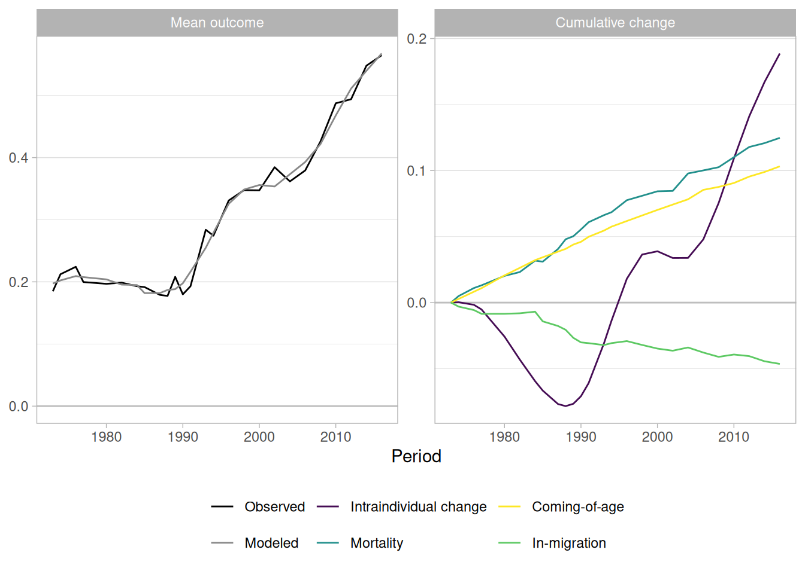

The headline split is essentially unchanged from the pooled model (~51%
intraindividual change, ~49% turnover): conditioning on sex barely moves
the population-weighted mean, because the sex composition is roughly
stable across waves.

What the covariate also adds is an *attribution* of every component to
the cells that produced it. Passing `covariate = "sex"` to
[`print()`](https://rdrr.io/r/base/print.html) or
[`plot()`](https://rdrr.io/r/graphics/plot.default.html) splits each row
into the contribution of each sex to the overall change. The split is
fully additive, so this is a genuine decomposition of the aggregate
change.

``` r

print(result, detailed = FALSE, covariate = "sex")
#>                 Component    Value Percent  female     male
#>  At initial (modeled)      0.19732                         
#>  At end (modeled)          0.56757                         
#>  Total change              0.37025   100.0 0.19629 0.17396 
#>  - Intraindividual change  0.18868   51.0  0.09976 0.08892 
#>  - Population turnover     0.18157   49.0  0.09653 0.08504 
#>    - Mortality             0.12478   33.7  0.01211 0.11267 
#>    - Coming-of-age         0.10323   27.9  0.06066 0.04256 
#>    - In-migration         -0.04643   -12.5 0.02376 -0.07020
plot(result, covariate = "sex")
```

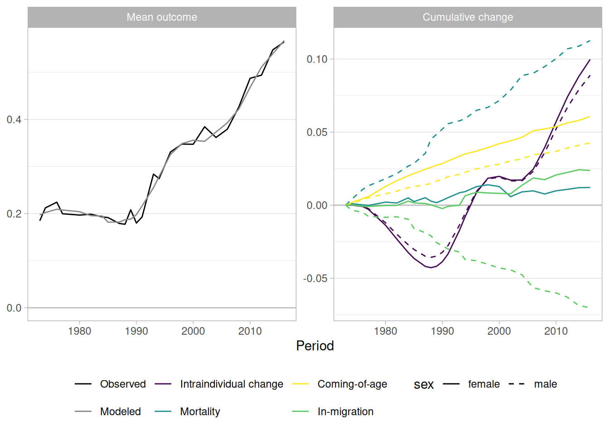

Reading down the columns, women and men contribute almost equally to
both intraindividual change (0.100 vs 0.089) and total turnover (0.097
vs 0.085), tracking their roughly equal population shares; women
contribute somewhat more overall (0.196 vs 0.174 of the 0.370 total
rise).

The interesting structure is *within* turnover, and it comes with a
caveat. Almost the entire mortality contribution loads onto men (0.113
vs 0.012 for women), offset by a large negative male in-migration term
(−0.070 vs +0.024). This asymmetry should not be read demographically.
Recall that on survey data each survivor cohort’s net change in size
across waves is routed in its entirety to mortality if the cohort shrank
or to in-migration if it grew (the decomposition never leaves a
residual). Splitting the already-noisy survey cells by sex halves the
counts and amplifies that sampling fluctuation, so the division of
turnover between mortality and migration within each sex is largely an
artifact of survey cell-size noise. This situation can be improving by
adding a population frame.

### Adding a population frame

So far the cell counts `n` have come from the survey itself, so the
demographic events are inferred from the noisy survey cell sizes across
waves. When true population counts are available, the `population`
argument lets the survey supply only the outcome `model`, while an
external frame supplies the cell counts that drive the demographic
events.

The package ships `wpp_us`, US population by age and sex from the UN
World Population Prospects for each survey year. Only the *relative*
cell structure matters, so we rescale each wave to a tractable
per-period total before passing it in.

``` r

data(wpp_us)

survey_years <- sort(unique(gss_all$period))
pop <- wpp_us[period %in% survey_years]
scale_total <- round(mean(gss_all[, .N, by = period]$N))
pop[, n := n / sum(n) * scale_total, by = period]

set.seed(42)
result <- decompose_aggregated(gss_all, model, cells = "sex",
                               weight = "wtssall", population = pop)
print(result, detailed = FALSE)
#>                 Component    Value Percent
#>  At initial (modeled)      0.19095        
#>  At end (modeled)          0.56823        
#>  Total change              0.37727   100.0
#>  - Intraindividual change  0.18754   49.7 
#>  - Population turnover     0.18974   50.3 
#>    - Mortality             0.10655   28.2 
#>    - Coming-of-age         0.10910   28.9 
#>    - In-migration         -0.02592   -6.9
plot(result)
```

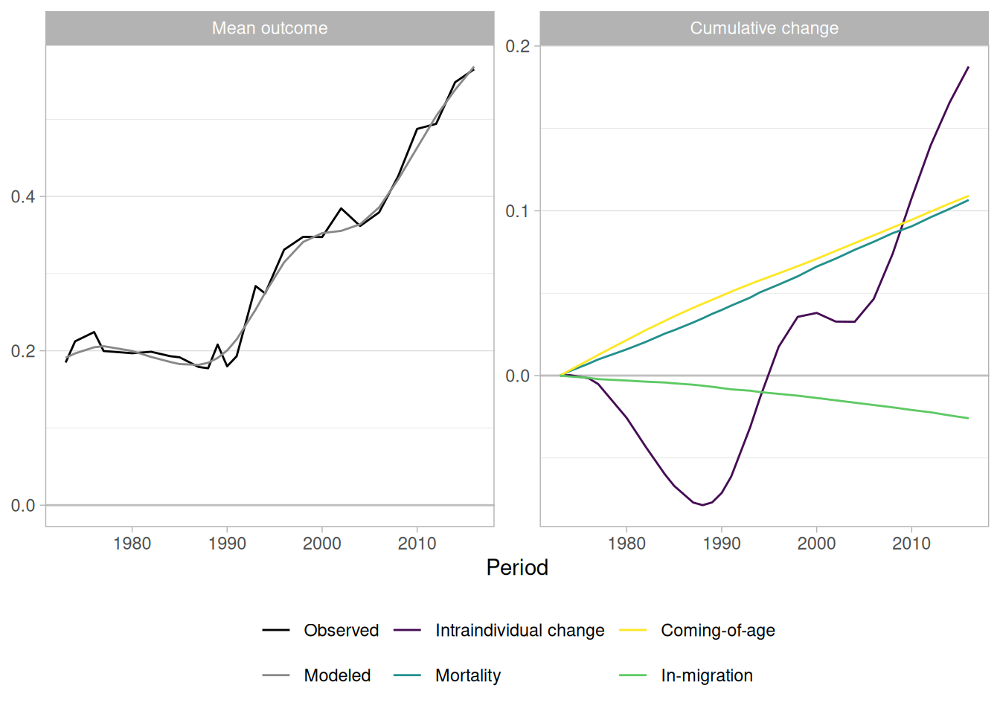

The intraindividual/turnover split is again similar (roughly 50/50), but
the turnover detail now reflects real demographics: mortality falls and
the net in-migration term shrinks toward zero (from about −0.046 to
−0.026), because the smoother true US age structure strips out much of
the cell-size noise that the survey counts introduced, leaving net
in-migration as a genuine signal of immigration rather than survey
noise.

The clearest payoff shows up in the per-sex breakdown, which we can
compare directly with the survey-counts version above.

``` r

print(result, detailed = FALSE, covariate = "sex")
#>                 Component    Value Percent   female      male
#>  At initial (modeled)      0.19095                           
#>  At end (modeled)          0.56823                           
#>  Total change              0.37727   100.0 0.19490  0.182376 
#>  - Intraindividual change  0.18754   49.7  0.09532  0.092220 
#>  - Population turnover     0.18974   50.3  0.09958  0.090156 
#>    - Mortality             0.10655   28.2  0.05568  0.050866 
#>    - Coming-of-age         0.10910   28.9  0.06364  0.045464 
#>    - In-migration         -0.02592   -6.9  -0.01974 -0.006175
plot(result, covariate = "sex")
```

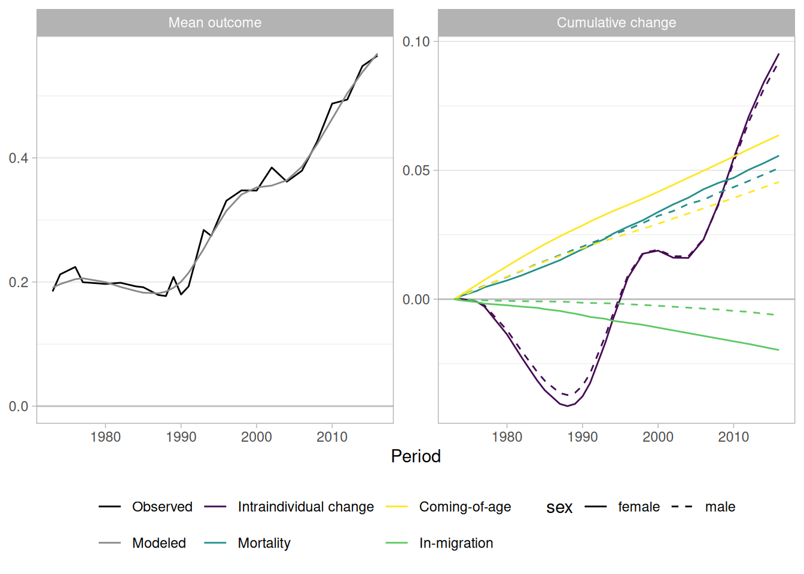

The mortality contribution, which the survey cells had loaded almost
entirely onto men (0.012 for women vs 0.113 for men), now splits roughly
evenly (0.056 vs 0.051) once real population counts drive the events.
The large offsetting male in-migration term collapses to a small,
plausibly-signed net term for both sexes, although female in-migration
still contributes significantly more compared to male in-migration. The
stable quantities barely move, confirming that the earlier
male-mortality / female-migration pattern was due to small cell counts.

### Standard errors

``` r

result <- decompose_aggregated(gss_all, model, cells = "sex",
                               weight = "wtssall", population = pop, R = 100)
#> Computing 100 bootstrap replicate(s); this can take a while for gam models.
print(result, detailed = FALSE)
#>                 Component    Value Percent             95% CI
#>  At initial (modeled)      0.19095                           
#>  At end (modeled)          0.56823                           
#>  Total change              0.37727   100.0 [0.3525, 0.4030]  
#>  - Intraindividual change  0.18748   49.7  [0.1520, 0.2223]  
#>  - Population turnover     0.18979   50.3  [0.1642, 0.2142]  
#>    - Mortality             0.10640   28.2  [0.0985, 0.1169]  
#>    - Coming-of-age         0.10927   29.0  [0.0830, 0.1310]  
#>    - In-migration         -0.02587   -6.9  [-0.0303, -0.0227]
plot(result)
```

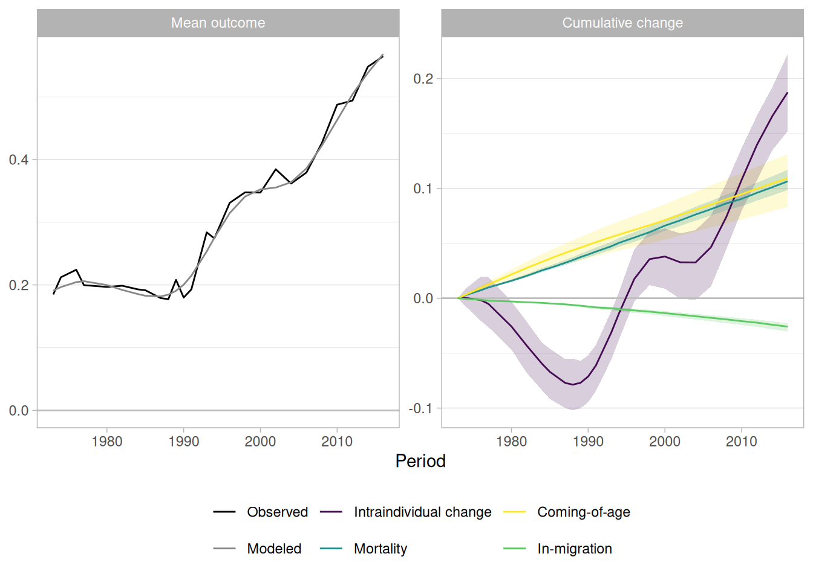

``` r

print(result, detailed = FALSE, covariate = "sex")
#>                 Component    Value Percent   female     male      female 95% CI
#>  At initial (modeled)      0.19095                                             
#>  At end (modeled)          0.56823                                             
#>  Total change              0.37727   100.0 0.19501  0.18227  [0.1822, 0.2082]  
#>  - Intraindividual change  0.18748   49.7  0.09534  0.09214  [0.0771, 0.1127]  
#>  - Population turnover     0.18979   50.3  0.09966  0.09013  [0.0872, 0.1122]  
#>    - Mortality             0.10640   28.2  0.05565  0.05075  [0.0503, 0.0650]  
#>    - Coming-of-age         0.10927   29.0  0.06373  0.04554  [0.0506, 0.0754]  
#>    - In-migration         -0.02587   -6.9  -0.01971 -0.00616 [-0.0233, -0.0172]
#>         male 95% CI
#>                    
#>                    
#>  [0.1704, 0.1948]  
#>  [0.0750, 0.1095]  
#>  [0.0771, 0.1020]  
#>  [0.0471, 0.0549]  
#>  [0.0320, 0.0567]  
#>  [-0.0071, -0.0053]
plot(result, covariate = "sex")
```

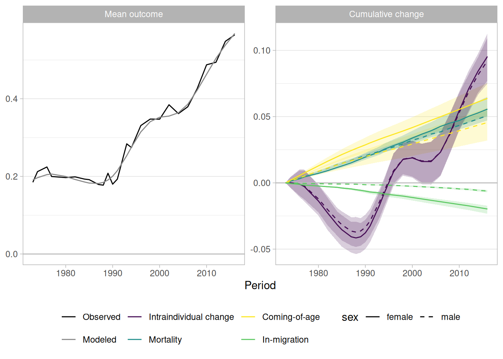

## Further reading

For APC analysis of the same `gss_homosex` dataset, see the [APC
vignette](https://elbersb.github.io/socialchange/articles/apc.md).
