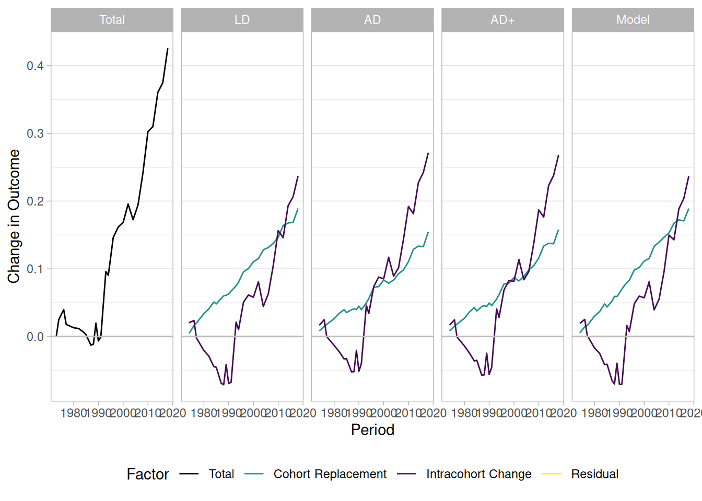

# Decomposing General Social Survey data: Attitudes on Homosexuality

The package includes a dataset `gss_homosex`, covering General Social
Survey data on attitudes towards homosexuality in the U.S. This data was
also analyzed in Ekstam (2021).

## Packages

``` r

library("socialchange")
library("modelsummary")
library("ggplot2")

data(gss_homosex)
```

## Descriptives

``` r

# compare to Table 1 in Ekstam -- roughly similar
modelsummary::datasummary(
  homosex + year + cohort + age + educ + sex + race ~ mean + SD + min + max,
  data = gss_homosex, output = "markdown", fmt = 3)
```

|                                  | mean     | SD     | min      | max      |
|----------------------------------|----------|--------|----------|----------|
| homosexual sex relations         | 0.326    | 0.440  | 0.000    | 1.000    |
| gss year for this respondent     | 1994.723 | 13.498 | 1973.000 | 2018.000 |
| cohort                           | 1948.626 | 21.067 | 1892.000 | 1995.000 |
| age of respondent                | 46.097   | 17.496 | 18.000   | 89.000   |
| highest year of school completed | 12.875   | 3.171  | 0.000    | 20.000   |
| respondents sex                  | 1.553    | 0.497  | 1.000    | 2.000    |
| race of respondent               | 1.237    | 0.538  | 1.000    | 3.000    |

``` r


by_year <- gss_homosex[, list(y = weighted.mean(homosex, wtssall)), by = c("year")]
ggplot(by_year, aes(x = year, y = y)) + geom_line() + ylim(0, 1) + theme_light()
```


## IC-CR decomposition

The
[`cr_ic()`](https://elbersb.github.io/socialchange/reference/cr_ic.md)
function implements four methods for separating intracohort change (IC)
from cohort replacement (CR): algebraic decomposition (AD), linear
decomposition (LD), and two model-based improvements (AD+ and Model).
For a detailed explanation of each method, including a replication of
Firebaugh (1989), see the [Replications:
Firebaugh](https://elbersb.github.io/socialchange/articles/replicating_firebaugh.md)
vignette.

``` r

# complete period
form <- homosex ~ as.factor(year) + as.factor(cohort)
(res <- cr_ic(gss_homosex, homosex ~ year + cohort, weight = "wtssall", model = form))
#> Cohort decomposition (year-over-year) with 27 periods:
#>    1973, 1974, 1976, 1977, 1980, 1982, 1984, 1985, 1987, 1988, 1989, 1990, 1991, 1993, 1994, 1996, 1998, 2000, 2002, 2004, 2006, 2008, 2010, 2012, 2014, 2016, 2018
#> 
#> Summary for entire period:
#>       1973      2018 Difference
#>      <num>     <num>      <num>
#>  0.1893911 0.6152818  0.4258907
#> 
#> Decompositions:
#>  method factor     value         %
#>  <char> <char>     <num>     <num>
#>      LD  total 0.4258907 100.00000
#>      LD     IC 0.2369375  55.63340
#>      LD     CR 0.1889532  44.36660
#>      LD  resid 0.0000000        NA
#>      AD  total 0.4258907 100.00000
#>      AD     IC 0.2713559  63.71491
#>      AD     CR 0.1545348  36.28509
#>      AD  resid 0.0000000        NA
#>     AD+  total 0.4258907 100.00000
#>     AD+     IC 0.2679414  62.91318
#>     AD+     CR 0.1579493  37.08682
#>     AD+  resid 0.0000000        NA
#>   Model  total 0.4258907 100.00000
#>   Model     IC 0.2369396  55.63391
#>   Model     CR 0.1889511  44.36609
#>   Model  resid 0.0000000        NA
```

``` r

plot(res)
```



``` r

# only beginning and end year (also compare to Baunach 2011)
form <- homosex ~ as.factor(year) + splines::bs(cohort, 10)
(res <- cr_ic(gss_homosex[year %in% c(min(year), max(year))], homosex ~ year + cohort, weight = "wtssall", model = form))
#> Cohort decomposition (year-over-year) with 2 periods:
#>    1973, 2018
#> 
#> Summary for entire period:
#>       1973      2018 Difference
#>      <num>     <num>      <num>
#>  0.1893911 0.6152818  0.4258907
#> 
#> Decompositions:
#>  method factor     value         %
#>  <char> <char>     <num>     <num>
#>      LD  total 0.4258907 100.00000
#>      LD     IC 0.1978149  46.44734
#>      LD     CR 0.2280758  53.55266
#>      LD  resid 0.0000000        NA
#>      AD  total 0.4258907 100.00000
#>      AD     IC 0.0605946  14.22775
#>      AD     CR 0.3652961  85.77226
#>      AD  resid 0.0000000        NA
#>     AD+  total 0.4258907 100.00000
#>     AD+     IC 0.1852284  43.49201
#>     AD+     CR 0.2406623  56.50799
#>     AD+  resid 0.0000000        NA
#>   Model  total 0.4258907 100.00000
#>   Model     IC 0.1967017  46.18597
#>   Model     CR 0.2291890  53.81403
#>   Model  resid 0.0000000        NA
```

For APC analysis of the same `gss_homosex` dataset, see the [APC
vignette](https://elbersb.github.io/socialchange/articles/apc.md).
