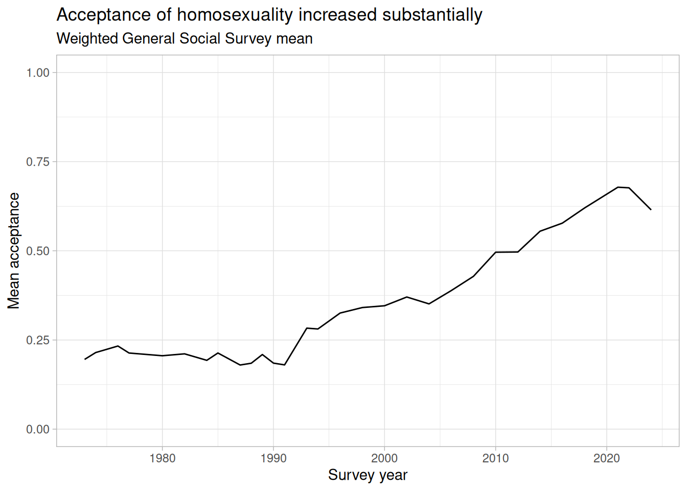
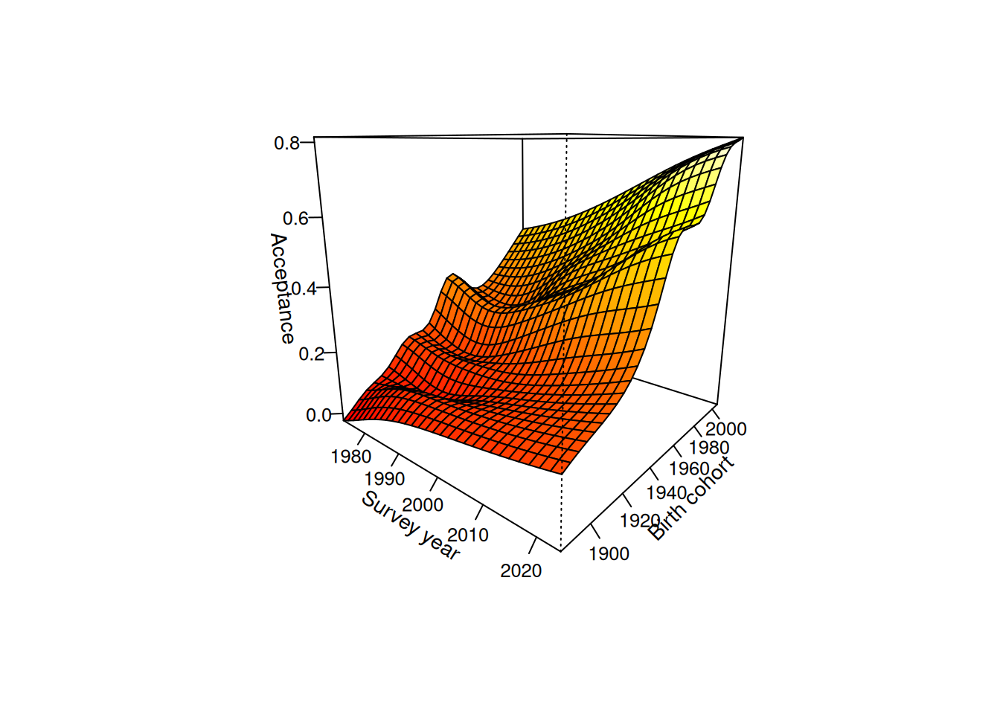
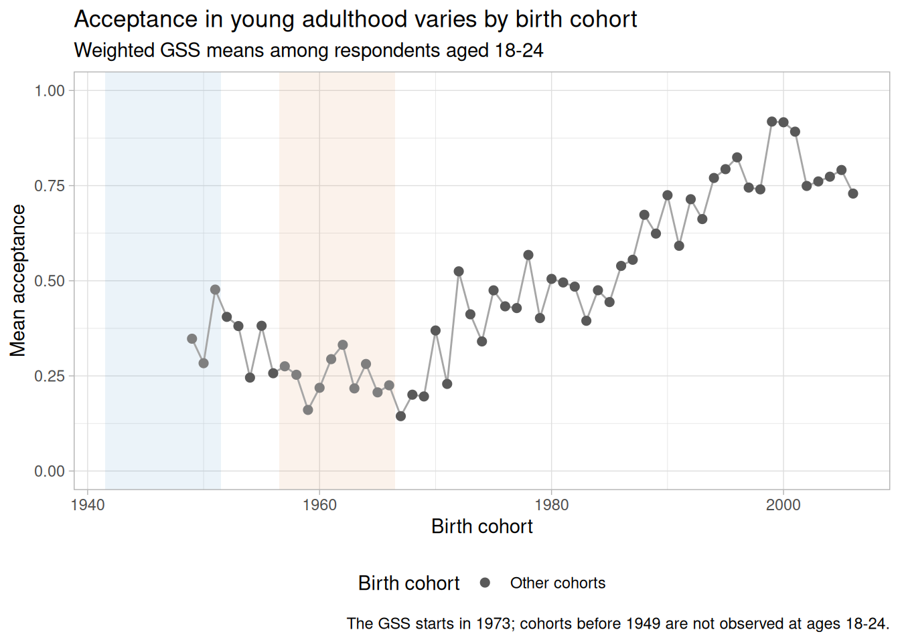
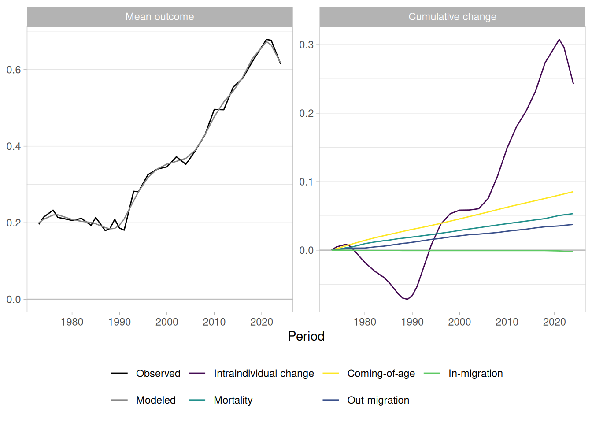
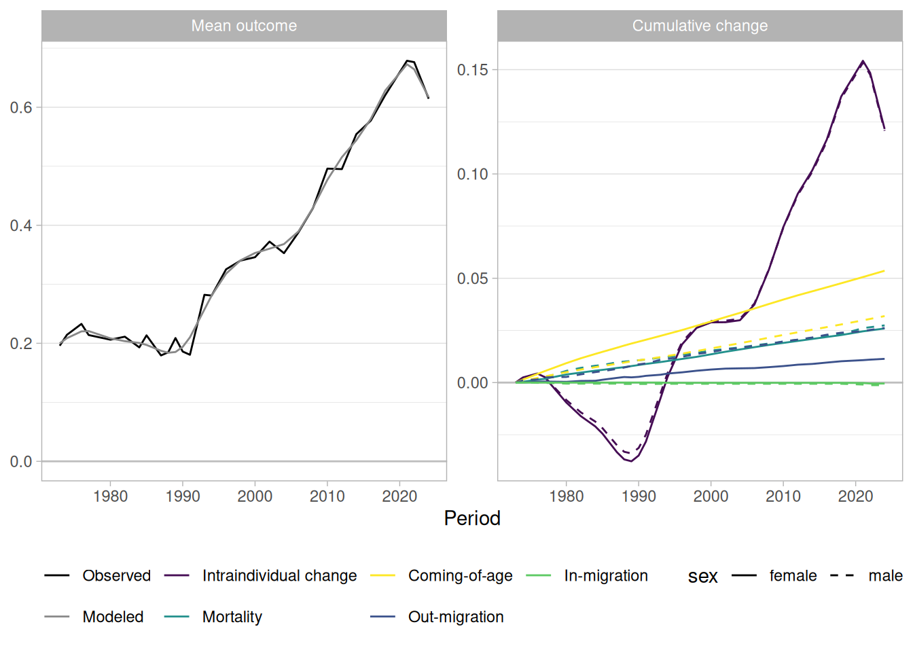
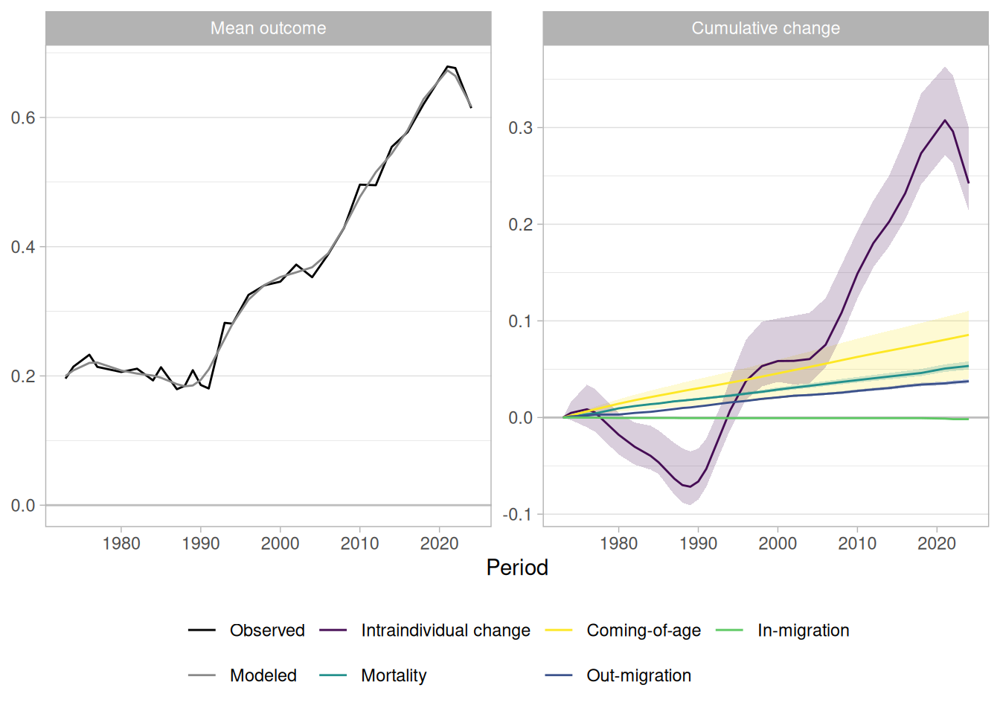
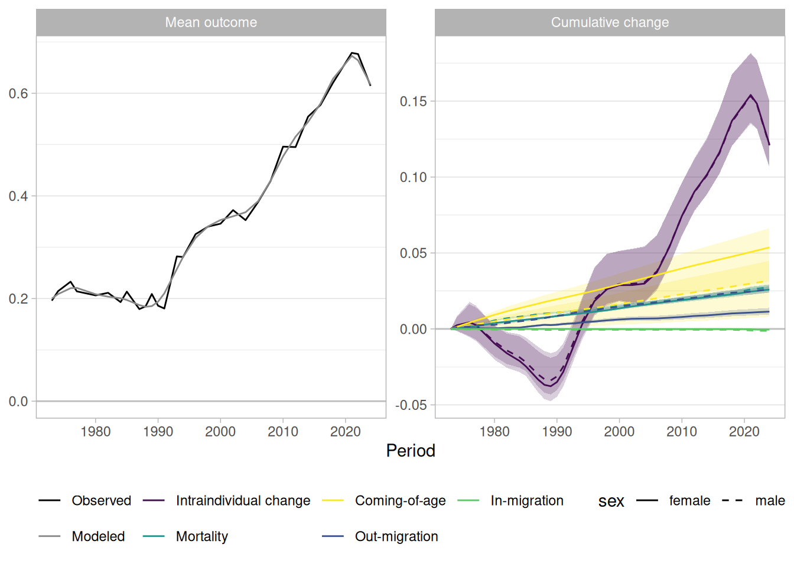
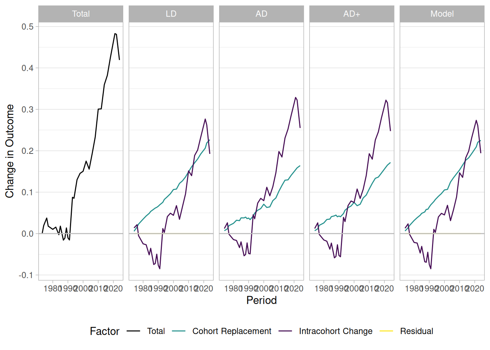

# Decomposing General Social Survey data: Attitudes toward homosexuality

The package includes `gss_homosex`, which covers General Social Survey
(GSS) data on attitudes toward homosexuality in the United States from
1973 through 2024. Ekstam ([2021](#ref-ekstam2021)) analyzes the same
GSS item through 2016. This vignette uses
[`decompose_aggregated()`](https://elbersb.github.io/socialchange/reference/decompose_aggregated.md)
to ask how much of the increase in acceptance reflects modeled change
within the surviving population and how much reflects population
turnover.

> **Key findings**
>
> - Acceptance increased by about 42 percentage points. The model
>   attributes about 58% of this rise to modeled change within the
>   surviving adult population (**intraindividual change**). The other
>   42% came from changes in who made up the population (**population
>   turnover**): more accepting younger people entered adulthood, less
>   accepting older people died, and the population changed through
>   migration.
> - From 1973 through 1988, people already in the adult population
>   became less accepting. Their opinion change pushed acceptance down,
>   while the entry of younger people and the death of older people
>   limited the decline. From 1988 through 2021, people already in the
>   adult population became more accepting. This broad opinion change
>   became the main source of rising acceptance, while generational
>   replacement continued to add to it.
> - From 2021 through 2024, intraindividual change was negative while
>   turnover remained positive. This provisional reversal forms a short
>   third phase.
> - The broad split is stable across the demographic inputs used below.
>   The allocation within turnover is not stable: population estimates
>   and mortality probabilities improve the attribution of mortality and
>   residual migration.

## Packages

``` r

library("socialchange")
library("modelsummary")
library("ggplot2")
library("mgcv")

data(gss_homosex)
```

## Observed change

The `homosex` outcome is rescaled to \[0, 1\], where 0 means “always
wrong” and 1 means “not wrong at all.” The question was not asked in
1972, 1975, 1978, 1983, or 1986, so those years are absent. In included
years, rows without a valid response are excluded. Most exclusions
reflect planned ballot assignment; the remainder are item nonresponse
([Davern et al. 2026](#ref-gss2024)).

``` r

modelsummary::datasummary(
  homosex + year + cohort + age + educ ~ mean + SD + min + max,
  data = gss_homosex, output = "markdown", fmt = 3)
```

|                                  | mean     | SD     | min      | max      |
|----------------------------------|----------|--------|----------|----------|
| homosexual sex relations         | 0.373    | 0.457  | 0.000    | 1.000    |
| gss year for this respondent     | 1998.734 | 15.897 | 1973.000 | 2024.000 |
| cohort                           | 1952.040 | 22.420 | 1884.000 | 2006.000 |
| age of respondent                | 46.694   | 17.700 | 18.000   | 89.000   |
| highest year of school completed |          | 3.184  |          |          |

``` r


# Sex and race are categorical, so show their level breakdown.
modelsummary::datasummary(
  sex + race ~ N + Percent(),
  data = gss_homosex, output = "markdown", fmt = 1)
```

|      |        | N     | Percent |
|------|--------|-------|---------|
| sex  | female | 24377 | 55.2    |
|      | male   | 19776 | 44.8    |
| race | black  | 6397  | 14.5    |
|      | other  | 2708  | 6.1     |
|      | white  | 34953 | 79.2    |

`wtssps` is the GSS post-stratification weight recommended for analyses
that span the full series. It incorporates the 1982 and 1987 Black
oversamples, so those respondents remain in the data ([Davern et al.
2026](#ref-gss2024)).

The weighted mean rose from about 0.20 in 1973 to 0.61 in 2024. The
final waves need special care. The 2021 round had no in-person
interviews, and later rounds used mixed modes. Their changes can reflect
mode effects as well as attitude change ([Davern et al.
2026](#ref-gss2024)).

``` r

by_year <- gss_homosex[, .(acceptance = weighted.mean(homosex, wtssps)), by = year]

ggplot(by_year, aes(x = year, y = acceptance)) +
  geom_line() +
  coord_cartesian(ylim = c(0, 1)) +
  labs(
    title = "Acceptance of homosexuality increased substantially",
    subtitle = "Weighted General Social Survey mean",
    x = "Survey year", y = "Mean acceptance"
  ) +
  theme_light()
```



A smooth surface provides a descriptive view of period and cohort
variation. Acceptance is higher in later periods and younger cohorts.
This surface is not the outcome model used in the decomposition below
and does not, by itself, identify causal period or cohort effects.

``` r

splinemodel <- gam(
  homosex ~ s(year, cohort),
  data = gss_homosex,
  weights = wtssps
)
vis.gam(
  splinemodel,
  view = c("year", "cohort"),
  type = "response", theta = 40,
  ticktype = "detailed",
  xlab = "Survey year", ylab = "Birth cohort", zlab = "Acceptance",
  cex.axis = 0.8, cex.lab = 0.9
)
```



Ekstam ([2021](#ref-ekstam2021)) describes higher tolerance among
cohorts born from 1942 through 1951 than among adjacent cohorts, and
lower tolerance among cohorts born from 1957 through 1966. He relates
these descriptive patterns to formative exposure to the counterculture
era and to the HIV/AIDS crisis and conservative climate of the 1980s.
Neither this surface nor an APC model can identify that socialization
explanation from age, period, and cohort patterns alone.

The figure below provides the closest direct comparison available in the
GSS: weighted cohort means at ages 18–24. Because the series starts in
1973, it cannot show most of the 1942–1951 cohorts during young
adulthood. The means also combine cohort and survey-period differences.



## What the decomposition measures

[`decompose_aggregated()`](https://elbersb.github.io/socialchange/reference/decompose_aggregated.md)
represents aggregate change as the sum of two broad components:

| Component | Interpretation |
|----|----|
| Intraindividual change | Change in the modeled outcome among the surviving population as age and period advance |
| Population turnover | Change caused by mortality, coming-of-age, and net migration |

The method combines an outcome model with period-specific population
cells. It places the demographic events between survey waves in random
order and records each event’s contribution to the population mean.

> **Interpretation**
>
> The GSS is a repeated cross-section. It does not follow the same
> respondents over time. “Intraindividual change” is therefore a
> model-based component, not a direct estimate of within-person change
> from panel observations. The plain-language descriptions below
> interpret this component as people changing. That plausible inference
> is an assumption that these data cannot test.

> **Technical background: event attribution**
>
> Every change in a cell count must be assigned to an event. Without
> supplied mortality probabilities, a shrinking survivor cell is
> assigned to mortality and a growing survivor cell is assigned to net
> in-migration. This **sign attribution** leaves no residual, but it
> cannot identify offsetting deaths and migration. With supplied
> mortality probabilities, deaths are calculated first and migration
> becomes the signed residual of the population-balancing identity.

## Prepare the outcome model and demographic inputs

All waves cover ages 18–89+. We pool ages 81 and older into a common
open outcome cell. A common open cell prevents respondents from aging
out of the observed range.

``` r

gss_all <- gss_homosex[,
  .(age = pmin(age, 81), period = year, sex, y = homosex, wtssps)
]
```

We model acceptance as an additive smooth function of age and period,
with a term for sex. We allow up to 15 basis functions for each smooth.
This flexibility captures the sharp change in the final waves without
materially changing the full-period split. The outcome model supplies
predicted acceptance for each cell; it does not determine the number of
people in each cell.

``` r

model <- mgcv::gam(
  y ~ s(age, k = 15) + s(period, k = 15) + sex,
  data = gss_all,
  weights = wtssps,
  method = "REML"
)
```

The package also includes two demographic inputs:

- `wpp_us`: U.S. population estimates by age and sex from the United
  Nations World Population Prospects ([United Nations, Department of
  Economic and Social Affairs, Population Division
  2024](#ref-unwpp2024)).
- `mortality_us`: U.S. central death rates by year, age, and sex from
  the Human Mortality Database ([Human Mortality Database
  2025](#ref-hmd2025)).

Only relative population structure matters. We therefore rescale each
population wave to a tractable total. Ages 81–88 and the terminal 89+
group remain separate for demographic calculations. Their outcome
predictions use the survey’s 81+ cell.

``` r

data(wpp_us)
data(mortality_us)

survey_years <- sort(unique(gss_all$period))
pop <- wpp_us[period %in% survey_years]
scale_total <- round(mean(gss_all[, .N, by = period]$N))
pop[, n := n / sum(n) * scale_total, by = period]

# decompose_aggregated() requires annual death probabilities rather than
# central death rates.
mort <- mortality_us[,
  .(period = year, age, sex, prob = 1 - exp(-death_rate))
]
```

> **Technical background: open age groups**
>
> The survey outcome model has an open 81+ cell. The population and
> mortality frames retain their constituent ages through a terminal 89+
> group. The method uses those constituent ages for aging and mortality,
> clamps their outcome predictions to age 81, and reports their
> contributions in the 81+ outcome cell. The terminal ages in the
> population and mortality frames must describe the same open group.

> **Technical background: survey weights**
>
> When no population frame is supplied, survey weights are normalized
> within each period to sum to the sample size. Rounded cell totals then
> preserve relative survey structure while keeping the simulation
> tractable. They are not population counts. A population frame is
> preferred when suitable estimates are available.

## Build the decomposition in three stages

The stages below hold the outcome model and sex cells constant. They
change only the information used to derive demographic events.

### 1. Survey counts

The simplest specification derives cell counts from the survey.

``` r

set.seed(42)
survey_result <- decompose_aggregated(
  gss_all, model,
  cells = "sex", weight = "wtssps"
)
print(survey_result, detailed = FALSE)
#> Strategy: sign attribution
#> 
#>                 Component  Value Percent
#>  At initial (modeled)      0.202        
#>  At end (modeled)          0.622        
#>  Total change              0.420   100.0
#>  - Intraindividual change  0.237    56.6
#>  - Population turnover     0.182    43.4
#>    - Mortality             0.079    18.8
#>    - Coming-of-age         0.051    12.0
#>    - In-migration          0.053    12.6
```

Survey cell sizes fluctuate across waves. The function must route that
fluctuation to mortality or in-migration. These detailed components must
not be read as demographic estimates.

### 2. Population frame

The `population` argument lets the survey supply the outcome model while
the external frame supplies the cell counts.

``` r

set.seed(42)
population_result <- decompose_aggregated(
  gss_all, model,
  cells = "sex", weight = "wtssps",
  population = pop
)
print(population_result, detailed = FALSE)
#> Strategy: sign attribution
#> 
#>                 Component  Value Percent
#>  At initial (modeled)      0.200        
#>  At end (modeled)          0.617        
#>  Total change              0.417   100.0
#>  - Intraindividual change  0.242    58.2
#>  - Population turnover     0.174    41.8
#>    - Mortality             0.089    21.3
#>    - Coming-of-age         0.085    20.5
#>    - In-migration          0.000     0.0
```

The smoother population structure removes most survey cell-size noise.
Net in-migration becomes small, but the mortality estimate still uses
sign attribution.

### 3. Population frame and mortality probabilities

Supplied mortality probabilities determine deaths directly. Migration
becomes the signed residual between estimated cohort survival and the
next population count.

``` r

set.seed(42)
mortality_result <- decompose_aggregated(
  gss_all, model,
  cells = "sex", weight = "wtssps",
  population = pop, mortality = mort
)
print(mortality_result, detailed = FALSE)
#> Strategy: residual migration
#> 
#>                 Component  Value Percent
#>  At initial (modeled)      0.200        
#>  At end (modeled)          0.617        
#>  Total change              0.417   100.0
#>  - Intraindividual change  0.242    58.1
#>  - Population turnover     0.175    41.9
#>    - Mortality             0.053    12.8
#>    - Out-migration         0.038     9.0
#>    - Coming-of-age         0.085    20.5
#>    - In-migration         -0.002    -0.4
```

This specification uses the most complete demographic information
available here. Its out-migration term is not a direct migration
estimate. It combines net migration with inconsistency between the
population estimates and mortality-based survival.

Show table code

``` r

summarize_result <- function(x, specification) {
  s <- x$summary
  total <- s[.N, modeled_mean] - s[1, modeled_mean]
  intraindividual <- s[, sum(intraindividual, na.rm = TRUE)]
  mortality <- s[, sum(mortality, na.rm = TRUE)]
  coming_of_age <- s[, sum(coming_of_age, na.rm = TRUE)]
  inmigration <- s[, sum(inmigration, na.rm = TRUE)]
  outmigration <- s[, sum(outmigration, na.rm = TRUE)]

  data.frame(
    Specification = specification,
    `Total change` = total,
    `Intraindividual` = intraindividual,
    `Turnover` = mortality + coming_of_age + inmigration + outmigration,
    `Mortality` = mortality,
    `Coming-of-age` = coming_of_age,
    `In-migration` = inmigration,
    `Out-migration` = outmigration,
    check.names = FALSE
  )
}

comparison <- rbind(
  summarize_result(survey_result, "Survey counts"),
  summarize_result(population_result, "Population frame"),
  summarize_result(mortality_result, "Population frame + mortality")
)
knitr::kable(comparison, digits = 3)
```

| Specification | Total change | Intraindividual | Turnover | Mortality | Coming-of-age | In-migration | Out-migration |
|:---|---:|---:|---:|---:|---:|---:|---:|
| Survey counts | 0.420 | 0.237 | 0.182 | 0.079 | 0.051 | 0.053 | 0.000 |
| Population frame | 0.417 | 0.242 | 0.174 | 0.089 | 0.085 | 0.000 | 0.000 |
| Population frame + mortality | 0.417 | 0.242 | 0.175 | 0.053 | 0.085 | -0.002 | 0.038 |

## Substantive findings

The preferred specification attributes about 58% of the modeled increase
to intraindividual change and 42% to population turnover. The broad
split changes little across the three specifications. In contrast, the
allocation of turnover between mortality and migration changes
materially when demographic information is added.

``` r

plot(mortality_result)
```



### Three phases of social change

The cumulative result contains three descriptive phases: two long
periods with distinct patterns, followed by a short provisional
reversal. The table summarizes these selected intervals.

Show table code

``` r

summarize_period <- function(x, start, end) {
  s <- x$summary
  changes <- s[period > start & period <= end]

  data.frame(
    Period = paste(start, end, sep = "--"),
    `Modeled change` =
      s[period == end, modeled_mean] - s[period == start, modeled_mean],
    `Intraindividual change` =
      changes[, sum(intraindividual, na.rm = TRUE)],
    `Population turnover` = changes[, sum(
      mortality + outmigration + coming_of_age + inmigration,
      na.rm = TRUE
    )],
    check.names = FALSE
  )
}

period_comparison <- rbind(
  summarize_period(mortality_result, 1973, 1988),
  summarize_period(mortality_result, 1988, 2021),
  summarize_period(mortality_result, 2021, 2024)
)
knitr::kable(period_comparison, digits = 3)
```

| Period    | Modeled change | Intraindividual change | Population turnover |
|:----------|---------------:|-----------------------:|--------------------:|
| 1973–1988 |         -0.016 |                 -0.070 |               0.054 |
| 1988–2021 |          0.489 |                  0.378 |               0.111 |
| 2021–2024 |         -0.056 |                 -0.065 |               0.009 |

From 1973 through 1988, modeled acceptance declined slightly.
Intraindividual change contributed −0.070, while population turnover
contributed +0.054. Turnover was already moving the population toward
greater acceptance, but change within the surviving population moved in
the opposite direction. The aggregate trend therefore conceals two
opposing social processes.

This early pattern matches the historical sequence described by Ekstam
([2021](#ref-ekstam2021)): advances associated with gay-rights
mobilization met organized conservative countermobilization in the
1970s, followed by a more hostile climate during the HIV/AIDS crisis of
the 1980s. Research documents both the role of the religious right in
shaping countermobilization ([Fetner 2008](#ref-fetner2008)) and
changing attitudes during the epidemic ([Ruel and Campbell
2006](#ref-ruelcampbell2006)). These accounts support the periodization,
but they do not establish the cause of the negative component.

From 1988 through 2021, modeled acceptance rose by 0.489.
Intraindividual change contributed +0.378, compared with +0.111 from
population turnover. Turnover remained positive, but change within the
existing population became the main source of rising acceptance. This
pattern is consistent with a shift from replacement offsetting
resistance to broader cultural diffusion across the population.

Proposed mechanisms for this diffusion include gay-rights movement
campaigns ([Epstein 1999](#ref-epstein1999)), changing elite messages
([Brewer 2003](#ref-brewer2003)), greater media visibility and
parasocial contact ([Schiappa et al. 2006](#ref-schiappa2006)), and
declining religious opposition ([Sherkat et al.
2011](#ref-sherkat2011)). The decomposition does not distinguish among
these mechanisms.

#### Post-2021 reversal?

From 2021 through 2024, modeled acceptance fell by 0.056.
Intraindividual change contributed −0.065, while population turnover
contributed +0.009. This resembles the early period: positive turnover
partly offsets negative intraindividual change.

The decomposition adds a demographic qualification to accounts of recent
anti-LGBTQ+ backlash. Population turnover continued to move acceptance
upward after 2021, but modeled change within the surviving population
moved it downward by a larger amount. Once coming-of-age, mortality, and
net migration are accounted for, the most plausible substantive
interpretation is that people already in the adult population became
less accepting. A panel would observe such changes directly; this
decomposition supports the inference indirectly through aggregate change
and demographic accounting.

The timing coincides with organized countermobilization. Jones
([2024](#ref-jones2024)) identifies 543 state anti-LGBTIQ+ bills
introduced from 2018 through 2022, commonly framed through parental,
religious, and women’s rights. McDowell and Ward
([2023](#ref-mcdowellward2023)) show how evangelical churchgoers framed
conservative Christians as marginalized to justify religious exemptions
that permit denial of services to LGBTQ+ people. These studies establish
a relevant political context, but they do not show that
countermobilization caused the change estimated here. Much of the recent
campaign targeted transgender people and youth, so its connection to
attitudes toward homosexuality remains indirect.

This short reversal does not establish a new sociological period. It
contains only two transitions, and its boundary follows the observed
2021 peak. Survey modes also changed after 2021. A sensitivity check
using the comparable 2022 and 2024 waves finds declines within each mode
and after standardizing the mode distribution. Changing mode composition
therefore does not explain the 2022–2024 decline, although other
measurement effects remain possible.

> **Mode-sensitivity check**
>
> The 2021 round had no in-person interviews. The 2022 and 2024 rounds
> included the same four mode categories, which permits a more direct
> comparison.
>
> ``` r
>
> mode_comparison <- gss_homosex[
>   year %in% c(2022, 2024) & !is.na(mode),
>   .(
>     acceptance = weighted.mean(homosex, wtssps),
>     mode_weight = sum(wtssps)
>   ),
>   by = .(year, mode)
> ]
>
> mode_mix_2022 <- mode_comparison[year == 2022, .(
>   mode,
>   share = mode_weight / sum(mode_weight)
> )]
> mode_standardized <- mode_comparison[mode_mix_2022, on = "mode"][, .(
>   acceptance = sum(acceptance * share)
> ), by = year]
>
> mode_table <- data.table::dcast(
>   mode_comparison, mode ~ year, value.var = "acceptance"
> )
> mode_table <- rbind(
>   mode_table[, .(Mode = mode, `2022` = `2022`, `2024` = `2024`)],
>   data.table::data.table(
>     Mode = "Standardized to 2022 mode mix",
>     `2022` = mode_standardized[year == 2022, acceptance],
>     `2024` = mode_standardized[year == 2024, acceptance]
>   )
> )
> knitr::kable(mode_table, digits = 3)
> ```
>
> | Mode                          |  2022 |  2024 |
> |:------------------------------|------:|------:|
> | in-person                     | 0.653 | 0.547 |
> | multimode                     | 0.795 | 0.533 |
> | phone                         | 0.675 | 0.524 |
> | web                           | 0.700 | 0.674 |
> | Standardized to 2022 mode mix | 0.677 | 0.595 |
>
> Acceptance declined within every interview mode. Holding the mode
> distribution at its 2022 composition increases the estimated decline
> from 0.062 to 0.082. Mode is a measurement condition rather than a
> demographic event, so it is not passed to the decomposition as a
> population cell.

### Contributions by sex

The decomposition is additive across the supplied cells. Passing
`covariate = "sex"` attributes each component to the sex cells that
produced it. These are contributions to aggregate change, not
sex-specific rates of change.

``` r

print(mortality_result, detailed = FALSE, covariate = "sex")
#> Strategy: residual migration
#> 
#>                 Component  Value Percent female   male
#>  At initial (modeled)      0.200                      
#>  At end (modeled)          0.617                      
#>  Total change              0.417   100.0  0.212  0.205
#>  - Intraindividual change  0.242    58.1  0.122  0.121
#>  - Population turnover     0.175    41.9  0.090  0.084
#>    - Mortality             0.053    12.8  0.026  0.027
#>    - Out-migration         0.038     9.0  0.011  0.026
#>    - Coming-of-age         0.085    20.5  0.054  0.032
#>    - In-migration         -0.002    -0.4 -0.000 -0.001
plot(mortality_result, covariate = "sex")
```



Women and men contribute similar amounts to the total increase.
Mortality and residual out-migration differ in their point estimates,
but these values do not identify sex differences in emigration. The
migration component remains a residual difference between two
demographic sources.

## Uncertainty

Passing `R > 0` adds bootstrap draws and empirical 95% intervals. Each
replicate uses a new random event ordering and a reweighted refit of the
outcome model. Here, `R = 100` keeps runtime manageable; its tail
estimates are illustrative.

``` r

set.seed(42)
bootstrap_result <- decompose_aggregated(
  gss_all, model,
  cells = "sex", weight = "wtssps",
  population = pop, mortality = mort,
  R = 100, seed = 42
)
#> Computing 100 bootstrap replicate(s); this can take a while for gam models.
print(bootstrap_result, detailed = FALSE)
#> Strategy: residual migration
#> 
#>                 Component  Value Percent           95% CI
#>  At initial (modeled)      0.200                         
#>  At end (modeled)          0.617                         
#>  Total change              0.417   100.0 [ 0.384, 0.455 ]
#>  - Intraindividual change  0.242    58.1 [ 0.213, 0.300 ]
#>  - Population turnover     0.175    41.9 [ 0.126, 0.201 ]
#>    - Mortality             0.053    12.8 [ 0.050, 0.058 ]
#>    - Out-migration         0.038     9.0 [ 0.035, 0.040 ]
#>    - Coming-of-age         0.086    20.5 [ 0.040, 0.110 ]
#>    - In-migration         -0.002    -0.4 [-0.002, -0.002]
plot(bootstrap_result)
```



The intervals quantify combined outcome-model and event-ordering
uncertainty. They do not include uncertainty in the population frame or
mortality probabilities. The reweighted bootstrap also does not
reproduce the GSS sample design or resample primary sampling units. It
must not be interpreted as a full design-based uncertainty estimate.

Sex-specific contributions and intervals are:

``` r

print(bootstrap_result, detailed = FALSE, covariate = "sex")
#> Strategy: residual migration
#> 
#>                 Component  Value Percent female   male    female 95% CI
#>  At initial (modeled)      0.200                                       
#>  At end (modeled)          0.617                                       
#>  Total change              0.417   100.0  0.212  0.205 [ 0.196, 0.231 ]
#>  - Intraindividual change  0.242    58.1  0.121  0.121 [ 0.107, 0.150 ]
#>  - Population turnover     0.175    41.9  0.091  0.084 [ 0.066, 0.103 ]
#>    - Mortality             0.053    12.8  0.026  0.027 [ 0.024, 0.029 ]
#>    - Out-migration         0.038     9.0  0.011  0.026 [ 0.009, 0.014 ]
#>    - Coming-of-age         0.086    20.5  0.054  0.032 [ 0.031, 0.066 ]
#>    - In-migration         -0.002    -0.4 -0.000 -0.001 [-0.001, -0.000]
#>       male 95% CI
#>                  
#>                  
#>  [ 0.189, 0.224 ]
#>  [ 0.106, 0.150 ]
#>  [ 0.059, 0.098 ]
#>  [ 0.025, 0.029 ]
#>  [ 0.024, 0.028 ]
#>  [ 0.008, 0.045 ]
#>  [-0.001, -0.001]
plot(bootstrap_result, covariate = "sex")
```



Marginal intervals for women and men do not test their difference. A sex
contrast must be calculated within each bootstrap replicate.

> **Technical background: event ordering**
>
> The timing and order of demographic events between survey waves are
> not observed. The method assigns events to evenly spaced positions in
> random order. With `R = 0`, the point estimate uses one ordering. With
> `R > 0`, it averages over `R` orderings and pairs each ordering with
> one model refit.

## Comparison with CR-IC decomposition

The classical cohort-replacement and intracohort-change framework
provides a useful benchmark.
[`cr_ic()`](https://elbersb.github.io/socialchange/reference/cr_ic.md)
implements algebraic decomposition (AD), linear decomposition (LD), and
two model-based improvements (AD+ and Model). For a detailed explanation
and a replication of Firebaugh ([1989](#ref-firebaugh1989)), see the
[Replications:
Firebaugh](https://elbersb.github.io/socialchange/articles/replicating_firebaugh.md)
vignette.

Using the same GSS item through 2016, Ekstam ([2021](#ref-ekstam2021))
shows that estimated linear age, period, and cohort trends change
substantially with the identifying constraints imposed by an APC model.
[`decompose_aggregated()`](https://elbersb.github.io/socialchange/reference/decompose_aggregated.md)
does not fit a conventional APC model. It defines components through
modeled outcome trajectories and demographic events, with the
assumptions described above.

Using all waves, AD+ attributes about 60% of the increase to intracohort
change and 40% to cohort replacement. The Model method gives 46% and
54%. These estimates bracket the broad split from
[`decompose_aggregated()`](https://elbersb.github.io/socialchange/reference/decompose_aggregated.md).

``` r

form <- homosex ~ as.factor(year) + as.factor(cohort)
cric_all <- cr_ic(
  gss_homosex,
  homosex ~ year + cohort,
  weight = "wtssps", model = form
)
cric_all
#> Cohort decomposition (year-over-year) with 30 periods:
#>    1973, 1974, 1976, 1977, 1980, 1982, 1984, 1985, 1987, 1988, 1989, 1990, 1991, 1993, 1994, 1996, 1998, 2000, 2002, 2004, 2006, 2008, 2010, 2012, 2014, 2016, 2018, 2021, 2022, 2024
#> 
#> Summary for entire period:
#>       1973      2024 Difference
#>      <num>     <num>      <num>
#>  0.1955244 0.6146811  0.4191566
#> 
#> Decompositions:
#>  method factor     value         %
#>  <char> <char>     <num>     <num>
#>      LD  total 0.4191566 100.00000
#>      LD     IC 0.1924893  45.92301
#>      LD     CR 0.2266673  54.07699
#>      LD  resid 0.0000000        NA
#>      AD  total 0.4191566 100.00000
#>      AD     IC 0.2549914  60.83440
#>      AD     CR 0.1641652  39.16560
#>      AD  resid 0.0000000        NA
#>     AD+  total 0.4191566 100.00000
#>     AD+     IC 0.2474673  59.03934
#>     AD+     CR 0.1716893  40.96066
#>     AD+  resid 0.0000000        NA
#>   Model  total 0.4191566 100.00000
#>   Model     IC 0.1940580  46.29725
#>   Model     CR 0.2250986  53.70275
#>   Model  resid 0.0000000        NA
plot(cric_all)
```



Using only the first and last survey years changes the decomposition.
AD+ attributes about 59% to cohort replacement and 41% to intracohort
change; the Model method gives 55% and 45%. This sensitivity shows why
the selected waves and functional form must be reported.

``` r

form <- homosex ~ as.factor(year) + splines::bs(cohort, 10)
cric_endpoints <- cr_ic(
  gss_homosex[year %in% c(min(year), max(year))],
  homosex ~ year + cohort,
  weight = "wtssps", model = form
)
cric_endpoints
#> Cohort decomposition (year-over-year) with 2 periods:
#>    1973, 2024
#> 
#> Summary for entire period:
#>       1973      2024 Difference
#>      <num>     <num>      <num>
#>  0.1955244 0.6146811  0.4191566
#> 
#> Decompositions:
#>  method factor     value         %
#>  <char> <char>     <num>     <num>
#>      LD  total 0.4191566 100.00000
#>      LD     IC 0.1786756  42.62741
#>      LD     CR 0.2404810  57.37259
#>      LD  resid 0.0000000        NA
#>      AD  total 0.4191566 100.00000
#>      AD     IC 0.0412290   9.83619
#>      AD     CR 0.3779276  90.16381
#>      AD  resid 0.0000000        NA
#>     AD+  total 0.4191566 100.00000
#>     AD+     IC 0.1732508  41.33320
#>     AD+     CR 0.2459058  58.66680
#>     AD+  resid 0.0000000        NA
#>   Model  total 0.4191566 100.00000
#>   Model     IC 0.1867125  44.54481
#>   Model     CR 0.2324441  55.45519
#>   Model  resid 0.0000000        NA
```

CR-IC summarizes change as intracohort change and cohort replacement.
[`decompose_aggregated()`](https://elbersb.github.io/socialchange/reference/decompose_aggregated.md)
instead tracks coming-of-age, mortality, and residual migration and
shows when each component accumulated.

## References

Brewer, Paul R. 2003. “The Shifting Foundations of Public Opinion about
Gay Rights.” *The Journal of Politics* 65 (4): 1208–20.

Davern, Michael, Rene Bautista, Jeremy Freese, Pamela Herd, and Stephen
L. Morgan. 2026. *General Social Survey 1972–2024: Codebook, 2024
Release 3a*. NORC at the University of Chicago.
<https://gss.norc.org/content/dam/gss/get-documentation/pdf/codebook/GSS%202024%20Codebook%20R3a.pdf>.

Ekstam, David. 2021. “The Liberalization of American Attitudes to
Homosexuality and the Impact of Age, Period, and Cohort Effects.”
*Social Forces* 100 (2): 905–29. <https://doi.org/10.1093/sf/soaa131>.

Epstein, Steven. 1999. “Gay and Lesbian Movements in the United States:
Dilemmas of Identity, Diversity, and Political Strategy.” In *The Global
Emergence of Gay and Lesbian Politics: National Imprints of a Worldwide
Movement*, edited by Barry D. Adam, Jan Willem Duyvendak, and André
Krouwel. Temple University Press.

Fetner, Tina. 2008. *How the Religious Right Shaped Lesbian and Gay
Activism*. University of Minnesota Press.

Firebaugh, Glenn. 1989. “Methods for Estimating Cohort Replacement
Effects.” *Sociological Methodology* 19: 243–62.

Human Mortality Database. 2025. *Human Mortality Database*.
<https://www.mortality.org/>.

Jones, Tiffany. 2024. “United States of Hate: Mapping Backlash Bills
Against LGBTIQ+ Youth.” *Sex Education* 24 (6): 816–35.
<https://doi.org/10.1080/14681811.2023.2241136>.

McDowell, Amy, and Pace T. Ward. 2023. “‘The Tables Are Turning’: The
Evangelical Defense of Anti-LGBTQ+ Religious Liberty.” *Sociology of
Religion* 84 (4): 406–25. <https://doi.org/10.1093/socrel/srad007>.

Ruel, Erin, and Richard T. Campbell. 2006. “Homophobia and HIV/AIDS:
Attitude Change in the Face of an Epidemic.” *Social Forces* 84 (4):
2167–78.

Schiappa, Edward, Peter B. Gregg, and Dean E. Hewes. 2006. “Can One TV
Show Make a Difference? A Will & Grace and the Parasocial Contact
Hypothesis.” *Journal of Homosexuality* 51 (4): 15–37.

Sherkat, Darren E., Melissa Powell-Williams, Gregory Maddox, and Kylan
M. De Vries. 2011. “Religion, Politics, and Support for Same-Sex
Marriage in the United States, 1988–2008.” *Social Science Research* 40
(1): 167–80.

United Nations, Department of Economic and Social Affairs, Population
Division. 2024. *World Population Prospects 2024, Online Edition*.
<https://population.un.org/wpp/>.
