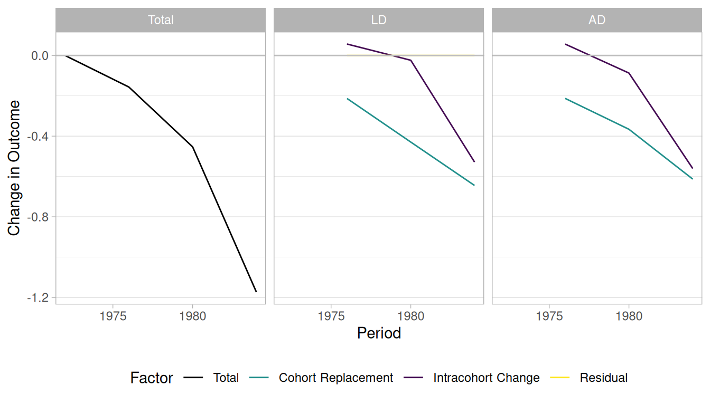

# Replications: Firebaugh

``` r

library("socialchange")
library("ggplot2")
library("data.table")
library("knitr")
options(digits = 3)
```

## Overview of methods

The goal is to decompose total change into two components: intracohort
change (IC) and cohort replacement (CR), ideally without a residual. The
same methods are applied to GSS attitudes on homosexuality in the [GSS
homosexuality
vignette](https://elbersb.github.io/socialchange/articles/gss_homosexuality.md).

This document contains analyses based on four methods:

- **Algebraic decomposition (AD):** The problem with the AD method
  concerns the “entering” and “exiting” cohorts. Because their values
  cannot be observed, it is unclear whether they contribute to IC or CR.
  Firebaugh assigns the change these cohorts contribute to CR, but notes
  this is “very problematic”.
- **Linear decomposition (LD):** Based on a linear model, and therefore
  cannot take into account non-linearities. Also produces a residual.
- **AD+:** A variation on the AD method that accounts for the entering
  and exiting cohorts by treating the problem as a missing data problem:
  the missing values for the entering/exiting cohort are replaced with
  modeled counterfactuals. This method should be strictly better than
  the AD method when the model fit is adequate.
- **Model:** Taking AD+ a step further: all cohort-specific values are
  replaced with modeled values. This serves as a form of regularization,
  which can be especially useful for small cohorts where the outcome is
  not precisely estimated.

Additionally, there is the question of whether to decompose over a long
period or year-by-year. When the data is available, year-by-year
decomposition has an obvious advantage because more data is used. This
applies to all four methods.

## Racial attitude data

### Replication of Firebaugh (1989)

This is (roughly) the data analysed in Firebaugh (1989) and Firebaugh
and Davis (1988).

``` r

# cr_ic requires a formula outcome ~ period + cohort
# it automatically decomposes the maximum time span available in the data
gss_rac_subset <- subset(gss_rac, year %in% c(1972, 1984))
results1 <- cr_ic(gss_rac_subset, rac ~ year + cohort, weight = "wtssall")
# compare these results to Firebaugh (1989), Table 1:
firebaugh <- data.table(
  group = c("AD", "AD", "AD", "AD", "LD", "LD", "LD", "LD"),
  factor = rep(c("total", "IC", "CR", "resid"), 2),
  firebaugh = c(-1.224, -.510, -.714, 0, -1.185, -.548, -.637, -.039))

kable(merge(results1$summary, firebaugh,
  all.x = TRUE, sort = FALSE)[, -c("pct_explained")])
```

| group      | factor |  value | firebaugh |
|:-----------|:-------|-------:|----------:|
| Outcome    | 1972   |  6.380 |        NA |
| Outcome    | 1984   |  5.207 |        NA |
| Difference | total  | -1.173 |        NA |
| LD         | total  | -1.173 |    -1.185 |
| LD         | IC     | -0.525 |    -0.548 |
| LD         | CR     | -0.649 |    -0.637 |
| LD         | resid  |  0.000 |    -0.039 |
| AD         | total  | -1.173 |    -1.224 |
| AD         | IC     | -0.511 |    -0.510 |
| AD         | CR     | -0.662 |    -0.714 |
| AD         | resid  |  0.000 |     0.000 |

The numbers are close to those reported by Firebaugh, though not an
exact match, which may reflect differences in the sample. For this
two-point comparison, LD and AD give essentially the same answer.

The `cr_ic_decomposition` object provides a useful summary:

``` r

results1
#> Cohort decomposition (year-over-year) with 2 periods:
#>    1972, 1984
#> 
#> Summary for entire period:
#>   1972  1984 Difference
#>  <num> <num>      <num>
#>   6.38  5.21      -1.17
#> 
#> Decompositions:
#>  method factor  value     %
#>  <char> <char>  <num> <num>
#>      LD  total -1.173 100.0
#>      LD     IC -0.525  44.7
#>      LD     CR -0.649  55.3
#>      LD  resid  0.000    NA
#>      AD  total -1.173 100.0
#>      AD     IC -0.511  43.6
#>      AD     CR -0.662  56.4
#>      AD  resid  0.000    NA
```

Using only two time points, intracohort change accounts for 45% of the
decline according to LD and 44% according to algebraic decomposition.

As an alternative, the decomposition can be computed year-over-year,
making use of all available data:

``` r

results2 <- cr_ic(gss_rac, rac ~ year + cohort, weight = "wtssall")
results2
#> Cohort decomposition (year-over-year) with 4 periods:
#>    1972, 1976, 1980, 1984
#> 
#> Summary for entire period:
#>   1972  1984 Difference
#>  <num> <num>      <num>
#>   6.38  5.21      -1.17
#> 
#> Decompositions:
#>  method factor  value     %
#>  <char> <char>  <num> <num>
#>      LD  total -1.173 100.0
#>      LD     IC -0.529  45.1
#>      LD     CR -0.645  54.9
#>      LD  resid  0.000    NA
#>      AD  total -1.173 100.0
#>      AD     IC -0.560  47.8
#>      AD     CR -0.613  52.2
#>      AD  resid  0.000    NA
```

The LD results are largely unaffected, while AD now attributes 48% of
the change to intracohort change — not a large difference.

The package provides a plot method that shows cumulative IC and CR
contributions over time:

``` r

plot(results2)
```



### New methods

The AD+ and Model methods require a model formula to produce
counterfactual values. Here, dummy variables for every year and cohort
are used, but simpler models (e.g., using splines) are also possible.

``` r

# define a formula here for the model-based methods
form <- rac ~ as.factor(year) + as.factor(cohort)

cr_ic(gss_rac_subset, rac ~ year + cohort, weight = "wtssall", model = form)
#> Cohort decomposition (year-over-year) with 2 periods:
#>    1972, 1984
#> 
#> Summary for entire period:
#>   1972  1984 Difference
#>  <num> <num>      <num>
#>   6.38  5.21      -1.17
#> 
#> Decompositions:
#>  method factor  value     %
#>  <char> <char>  <num> <num>
#>      LD  total -1.173 100.0
#>      LD     IC -0.525  44.7
#>      LD     CR -0.649  55.3
#>      LD  resid  0.000    NA
#>      AD  total -1.173 100.0
#>      AD     IC -0.511  43.6
#>      AD     CR -0.662  56.4
#>      AD  resid  0.000    NA
#>     AD+  total -1.173 100.0
#>     AD+     IC -0.604  51.5
#>     AD+     CR -0.569  48.5
#>     AD+  resid  0.000    NA
#>   Model  total -1.173 100.0
#>   Model     IC -0.601  51.3
#>   Model     CR -0.572  48.7
#>   Model  resid  0.000    NA
```

These results apply to the two-time-point dataset. Both new methods
suggest IC \> CR.

Now using all available data:

``` r

(res <- cr_ic(gss_rac, rac ~ year + cohort, weight = "wtssall", model = form))
#> Cohort decomposition (year-over-year) with 4 periods:
#>    1972, 1976, 1980, 1984
#> 
#> Summary for entire period:
#>   1972  1984 Difference
#>  <num> <num>      <num>
#>   6.38  5.21      -1.17
#> 
#> Decompositions:
#>  method factor  value     %
#>  <char> <char>  <num> <num>
#>      LD  total -1.173 100.0
#>      LD     IC -0.529  45.1
#>      LD     CR -0.645  54.9
#>      LD  resid  0.000    NA
#>      AD  total -1.173 100.0
#>      AD     IC -0.560  47.8
#>      AD     CR -0.613  52.2
#>      AD  resid  0.000    NA
#>     AD+  total -1.173 100.0
#>     AD+     IC -0.569  48.5
#>     AD+     CR -0.605  51.5
#>     AD+  resid  0.000    NA
#>   Model  total -1.173 100.0
#>   Model     IC -0.588  50.1
#>   Model     CR -0.585  49.9
#>   Model  resid  0.000    NA
```

The IC component is larger for these methods than for AD and LD, but the
overall conclusion does not change substantially.

The CR-IC decompositions here work from aggregated cohort-level data.
For a more granular approach that directly tracks demographic events
(mortality, coming-of-age) and allows state transitions, see the
[simulation](https://elbersb.github.io/socialchange/articles/simulate.md)
and [aggregated
decomposition](https://elbersb.github.io/socialchange/articles/decompose_aggregated.md)
vignettes.
