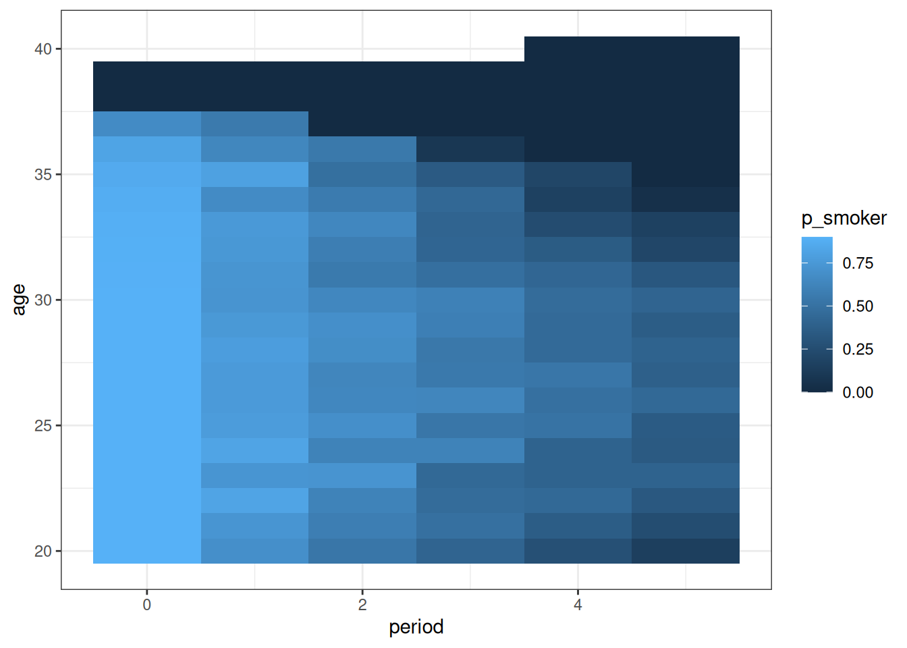

# Simulating social change

The package contains a function `sim_social_change` that allows the user
to explore different scenarios of how social change can happen. The
complexity of the simulation is up to the user to define. We’ll start
simple and build up a more complicated simulation over time. The
scenarios in this vignette are also used to validate
[`decompose_aggregated()`](https://elbersb.github.io/socialchange/reference/decompose_aggregated.md)
— see the [aggregated decomposition
vignette](https://elbersb.github.io/socialchange/articles/decompose_aggregated.md),
which uses the simulation output as ground truth.

## Starting with a simple simulation (Scenario 1)

Building up a simulation requires three steps:

- Define your population
- Define the outcome function for the variable of interest
- Define the population dynamics (coming of age, mortality, in- and
  out-migration)

**Step 1**: The first step is to define an initial population. As an
example, we define a simple population aged between 20 and 39, with a
uniform distribution until age 30, declining up until age 39. The
dataset that you define here needs at least two columns: `age` and `n`.
You can add more columns if you want to describe more complicated
populations, but we’ll stick with the simple setup for now. We’ll call
each row of this dataset a *population cell*. In the extreme case, you
can also define a population of individuals where each `n` is just 1.

Here’s our simple population:

``` r

library("data.table")

data <- data.table(
    age = c(20:39),
    n = c(rep(100, 10), seq.int(100, 10, by = -10))
)

data
#>       age     n
#>     <int> <num>
#>  1:    20   100
#>  2:    21   100
#>  3:    22   100
#>  4:    23   100
#>  5:    24   100
#>  6:    25   100
#>  7:    26   100
#>  8:    27   100
#>  9:    28   100
#> 10:    29   100
#> 11:    30   100
#> 12:    31    90
#> 13:    32    80
#> 14:    33    70
#> 15:    34    60
#> 16:    35    50
#> 17:    36    40
#> 18:    37    30
#> 19:    38    20
#> 20:    39    10
#>       age     n
#>     <int> <num>
```

**Step 2**: Next, we define the variable of interest that we want to
simulate. To do this, define a function that takes as arguments your
population cells and time as a continuous variable. Time really needs to
be continuous here - we need to know the outcome of every individual in
the population not only in terms of discrete ‘years’ (or whatever your
time scale), but at every point in-between as well. In our example, we
use an outcome that is only dependent on age: at age 20, the outcome is
0, and at age 40 the outcome is 1, with values linearly increasing by
age. This is purely a function of age, not of time, so in a real-world
survey, this outcome could be “support for investing in longevity
research” or “support for increasing pensions” - we’ll just use the
latter as an example:

``` r

support_for_pensions <- function(data, time) {
    data[, (age - 20) * 1 / 20]
}
# e.g., at age 20,   support_for_pensions is 0
#       at age 20.5, support_for_pensions is 0.026
#       at age 40,   support_for_pensions is 1
```

Because we defined our population only in terms of one variable (age),
all members of the same age also have an identical outcome value.

**Step 3**: The next step is to define the population dynamics. This
requires defining up to four functions:

- `fun_mortality(data, period)` - needs to return a vector of counts for
  each population cell
- `fun_outmigration(data, period)` - needs to return a vector of counts
  for each population cell
- `fun_coming_of_age(data, period)` - needs to return a data frame with
  new population cells and a column `n`
- `fun_inmigration(data, period)` - needs to return a data frame with
  new population cells and a column `n`

All of these functions are defined period-over-period. In practice, this
will often be years. For instance, the mortality function should return
counts that define how many members of your population die within the
next period, in each population cell. The out-migration function is
defined in the same way, just for the number of people migrating out of
each population cell. The coming of age function and in-migration
functions are different: They should return a data frame that describes
the new population members that are added period-over-period.

These functions are flexible enough to describe very complicated
real-world population dynamics. For our first simple example, we will
define these functions in a way that keeps the population stable: we
don’t have any migration, and mortality and coming-of-age balances out
perfectly - every period 100 new members of age 20 are added, and 100
members age 30 and over die. All four functions are optional, so we just
define a coming-of-age and a mortality function:

``` r

coming_of_age <- function(data, period) {
    data.table(age = 20, n = 100)
}
mortality <- function(data, period) {
    data[, ifelse(age >= 30, 10, 0)]
}
```

We’re now ready to start the simulation:

``` r

library(socialchange)

simresult <- socialchange::sim_social_change(
    periods = 5,
    data = data,
    fun_y = support_for_pensions,
    fun_coming_of_age = coming_of_age,
    fun_mortality = mortality
)
simresult
#> Overview by period:
#>  period   mean    N intraindividual coming_of_age mortality inmigration
#>       0 0.3758 1550              NA            NA        NA          NA
#>       1 0.3758 1550            0.05      -0.02583  -0.02417           0
#>       2 0.3758 1550            0.05      -0.02582  -0.02418           0
#>       3 0.3758 1550            0.05      -0.02583  -0.02417           0
#>       4 0.3758 1550            0.05      -0.02588  -0.02412           0
#>       5 0.3758 1550            0.05      -0.02589  -0.02411           0
#>  outmigration
#>            NA
#>             0
#>             0
#>             0
#>             0
#>             0
#> 
#> Decomposition of total change:
#>                 Component   Value
#>  At initial                0.3758
#>  At end                    0.3758
#>  Total change              0.0000
#>  - Intraindividual change  0.2500
#>  - Population turnover    -0.2500
#>    - Mortality            -0.1207
#>    - Out-migration         0.0000
#>    - Coming-of-age        -0.1293
#>    - In-migration          0.0000
```

The simulation result displays both an overview for each period, as well
as a summary for the total decomposition of change. The results by year
show that indeed our population is stable: at the end of every period we
have a population of 1550, and a stable mean of 0.38 - i.e, 38% of this
population supports increasing pensions. However, this stability is a
bit deceptive, because everyone’s opinion actually keeps constantly
changing. We can see that by looking at the “Intraindividual change”
component, which is +0.25. Roughly speaking, without population
turnover, we would have expected that the mean support for increasing
pensions would have increased quite a bit, to 63%. This makes sense, as
we’ve designed this simulation in a way where support increases with
age. In turn, younger people are much less likely to support increasing
pensions. Hence, when they enter the population, that has the effect of
decreasing the mean. The same is true for mortality. Hence, the
population turnover component is negative. In this simulation, the two
components balance out exactly, leading to the expected complete
stabilty in the year-over-year mean.

### Adding a covariate (Scenario 2)

For a slightly more complex setup, we can add covariates to the
simulation. For instance, we can introduce a gender covariate. As an
example, we split the former population into two equally-distributed
genders:

``` r

data <- data.table(
    age = c(20:39, 20:39),
    gender = c(rep("f", 20), rep("m", 20)),
    n = c(
        c(rep(50, 10), seq.int(50, 5, by = -5)),
        c(rep(50, 10), seq.int(50, 5, by = -5))
    )
)
```

We also adjust the population dynamics functions to keep the population
stable. Note that these don’t depend on gender (but they could):

``` r

coming_of_age <- function(data, period) {
    data.table(age = c(20, 20), gender = c("f", "m"), n = c(50, 50))
}
mortality <- function(data, period) {
    data[, ifelse(age >= 30, 5, 0)]
}
```

If you reran the simulation with these settings, you will get the exact
same results as before. We will introduce a slight variation, though,
and determine that one gender actually has a fixed opinion on the
support for increasing pensions. The other gender behaves as before:

``` r

support_for_pensions <- function(data, time) {
    data[, ifelse(gender == "f", 0.3758, (age - 20) * 1 / 20)]
}
```

``` r

simresult <- socialchange::sim_social_change(
    periods = 5,
    data = data,
    fun_y = support_for_pensions,
    fun_coming_of_age = coming_of_age,
    fun_mortality = mortality
)
simresult
#> Overview by period:
#>  period   mean    N intraindividual coming_of_age mortality inmigration
#>       0 0.3758 1550              NA            NA        NA          NA
#>       1 0.3758 1550         0.02493      -0.01292  -0.01201           0
#>       2 0.3758 1550         0.02487      -0.01287  -0.01200           0
#>       3 0.3758 1550         0.02489      -0.01287  -0.01203           0
#>       4 0.3758 1550         0.02498      -0.01291  -0.01207           0
#>       5 0.3758 1550         0.02499      -0.01293  -0.01206           0
#>  outmigration
#>            NA
#>             0
#>             0
#>             0
#>             0
#>             0
#> 
#> Decomposition of total change:
#>                 Component    Value
#>  At initial                0.37580
#>  At end                    0.37580
#>  Total change              0.00000
#>  - Intraindividual change  0.12466
#>  - Population turnover    -0.12466
#>    - Mortality            -0.06017
#>    - Out-migration         0.00000
#>    - Coming-of-age        -0.06450
#>    - In-migration          0.00000
```

Although the overall mean doesn’t change over time, the decomposition
results have changed. Because only men now contribute to both population
turnover and intraindividual change (and women do not), the components
are half of what they were before.

### Only intraindividual change (Scenario 3)

In the previous scenario, the overall outcome was stable, and we had
both intraindividual change as well as population turnover, cancelling
each other out. We can also construct a case that shows only
intraindividual change, by making the outcome function dependent only on
time (and possibly other covariates, as we do here), but not on age.

``` r

ic_only <- function(data, time) {
    data[, ifelse(gender == "f", 0.2, 0.4) + time / 10]
}
```

As expected, the results show that the outcome increased by 0.1
year-over-year, and that all of this change is due to intraindividual
change:

``` r

simresult <- socialchange::sim_social_change(
    periods = 5,
    data = data,
    fun_y = ic_only,
    fun_coming_of_age = coming_of_age,
    fun_mortality = mortality
)
simresult
#> Overview by period:
#>  period mean    N intraindividual coming_of_age   mortality inmigration
#>       0  0.3 1550              NA            NA          NA          NA
#>       1  0.4 1550             0.1   -0.00002062  0.00002062           0
#>       2  0.5 1550             0.1   -0.00001884  0.00001884           0
#>       3  0.6 1550             0.1    0.00001659 -0.00001659           0
#>       4  0.7 1550             0.1    0.00001928 -0.00001928           0
#>       5  0.8 1550             0.1   -0.00001291  0.00001291           0
#>  outmigration
#>            NA
#>             0
#>             0
#>             0
#>             0
#>             0
#> 
#> Decomposition of total change:
#>                 Component     Value
#>  At initial                0.300000
#>  At end                    0.800000
#>  Total change              0.500000
#>  - Intraindividual change  0.500000
#>  - Population turnover     0.000000
#>    - Mortality             0.000016
#>    - Out-migration         0.000000
#>    - Coming-of-age        -0.000016
#>    - In-migration          0.000000
```

### Only population turnover (Scenario 4)

Conversely, we can also construct a scenario where all change is
explained by population turnover - older cohorts being replaced by
younger cohorts. For this, we define the outcome as a function of the
individual’s birth cohort:

``` r

pt_only <- function(data, time) {
    data[, ifelse(gender == "f", 0.2, 0.4) + 0.7516 + (time - age + 20) / 10]
}
```

The constants have been chosen such that the two cases align. The
important thing here is that the outcome depends only on the birth
cohort (i.e. cohort = year - age).

The results show the exact same dynamic as before – an initial mean of
0.3 and an increase by 0.1 every year –, but very different
explanations: Now the change is completely explained by population
turnover. No one ever changes their mind, social change only occurs
because older cohorts with low outcome values die out and younger
cohorts with higher outcome values follow. Hence, both mortality and
coming-of-age contribute equally to the total change.

``` r

simresult <- socialchange::sim_social_change(
    periods = 5,
    data = data,
    fun_y = pt_only,
    fun_coming_of_age = coming_of_age,
    fun_mortality = mortality
)
simresult
#> Overview by period:
#>  period mean    N        intraindividual coming_of_age mortality inmigration
#>       0  0.3 1550                     NA            NA        NA          NA
#>       1  0.4 1550 -0.0000000000000012768       0.05177   0.04823           0
#>       2  0.5 1550  0.0000000000000006661       0.05163   0.04837           0
#>       3  0.6 1550 -0.0000000000000007772       0.05172   0.04828           0
#>       4  0.7 1550  0.0000000000000023315       0.05166   0.04834           0
#>       5  0.8 1550 -0.0000000000000007772       0.05171   0.04829           0
#>  outmigration
#>            NA
#>             0
#>             0
#>             0
#>             0
#>             0
#> 
#> Decomposition of total change:
#>                 Component  Value
#>  At initial               0.3000
#>  At end                   0.8000
#>  Total change             0.5000
#>  - Intraindividual change 0.0000
#>  - Population turnover    0.5000
#>    - Mortality            0.2415
#>    - Out-migration        0.0000
#>    - Coming-of-age        0.2585
#>    - In-migration         0.0000
```

## Adding state changes: Smoking and differential mortality

As a second example, we try to simulate a somewhat realistic scenario in
how attitudes towards smoking have changed in Western societies. We
start simple and build up more complex simulations piece by piece. As an
outcome, we consider a survey question such as “Should smoking in public
be allowed?”.

We start with a similar population again, this time split up into
smokers and non-smokers, where the vast majority of the population
smokes (90% for the younger age groups). We construct this initial
population already in a way such that it shows differential mortality:
Smokers die early, meaning that a higher ages, the proportion of
non-smokers increases:

``` r

data <- data.table(
    age = c(20:39, 20:39),
    smoking = c(rep("smoker", 20), rep("nonsmoker", 20)),
    n = c(
        c(rep(90, 10), seq.int(90, 0, by = -12), 0, 0),
        c(rep(10, 10), seq.int(10, 1, by = -1))
    )
)
# reshape the data to show proportion non-smoking
dcast(data, age ~ smoking, value.var = "n")[,
    .(age, nonsmoker, smoker, prop_non_smoking = nonsmoker / (smoker + nonsmoker))
]
#> Key: <age>
#>       age nonsmoker smoker prop_non_smoking
#>     <int>     <num>  <num>            <num>
#>  1:    20        10     90        0.1000000
#>  2:    21        10     90        0.1000000
#>  3:    22        10     90        0.1000000
#>  4:    23        10     90        0.1000000
#>  5:    24        10     90        0.1000000
#>  6:    25        10     90        0.1000000
#>  7:    26        10     90        0.1000000
#>  8:    27        10     90        0.1000000
#>  9:    28        10     90        0.1000000
#> 10:    29        10     90        0.1000000
#> 11:    30        10     90        0.1000000
#> 12:    31         9     78        0.1034483
#> 13:    32         8     66        0.1081081
#> 14:    33         7     54        0.1147541
#> 15:    34         6     42        0.1250000
#> 16:    35         5     30        0.1428571
#> 17:    36         4     18        0.1818182
#> 18:    37         3      6        0.3333333
#> 19:    38         2      0        1.0000000
#> 20:    39         1      0        1.0000000
#>       age nonsmoker smoker prop_non_smoking
#>     <int>     <num>  <num>            <num>
```

We again disregard migration, and create a coming-of-age and mortality
function that reproduces the current population:

``` r

coming_of_age <- function(data, period) {
    data.table(age = c(20, 20), smoking = c("smoker", "nonsmoker"), n = c(90, 10))
}
mortality <- function(data, period) {
    data[, fcase(
        # we need to make sure that we still have enough individuals, therefore the pmin
        age >= 30 & smoking == "smoker", pmin(12, n),
        age >= 30 & smoking == "nonsmoker", 1,
        default = 0
    )]
}
```

Lastly, we define a static outcome that differs only between smokers and
non-smokers, but is otherwise stable: 90% of smokers agree that smoking
in public should be allowed, while only 60% of non-smokers do:

``` r

smoking_in_public <- function(data, time) {
    data[, ifelse(smoking == "smoker", 0.9, 0.6)]
}
```

Running the simulation for this scenario shows a static population:

``` r

smoking1 <- socialchange::sim_social_change(
    periods = 5,
    data = data,
    fun_y = smoking_in_public,
    fun_coming_of_age = coming_of_age,
    fun_mortality = mortality
)
smoking1
#> Overview by period:
#>  period   mean    N        intraindividual coming_of_age  mortality inmigration
#>       0 0.8677 1439                     NA            NA         NA          NA
#>       1 0.8677 1439 -0.0000000000000009992     0.0001167 -0.0001167           0
#>       2 0.8677 1439 -0.0000000000000016653     0.0001781 -0.0001781           0
#>       3 0.8677 1439 -0.0000000000000027756     0.0001440 -0.0001440           0
#>       4 0.8677 1439 -0.0000000000000001110     0.0001727 -0.0001727           0
#>       5 0.8677 1439 -0.0000000000000003331     0.0001208 -0.0001208           0
#>  outmigration
#>            NA
#>             0
#>             0
#>             0
#>             0
#>             0
#> 
#> Decomposition of total change:
#>                 Component     Value
#>  At initial                0.867686
#>  At end                    0.867686
#>  Total change              0.000000
#>  - Intraindividual change  0.000000
#>  - Population turnover     0.000000
#>    - Mortality            -0.000732
#>    - Out-migration         0.000000
#>    - Coming-of-age         0.000732
#>    - In-migration          0.000000
```

There is neither intra-individual change nor any net effect of
population turnover, although mortality decreases the mean (as smokers
die earlier, drawing down the mean), while coming-of-age brings it back
up. These two forces therefore perfectly cancel each other out.

For a slightly more realistic scenario, we assume that both smokers and
non-smokers change their mind about smoking in public, however, smokers
change their mind only at half the rate compared to non-smokers:

``` r

smoking_in_public <- function(data, time) {
    data[, ifelse(smoking == "smoker", 0.9 - time*0.05, 0.6 - time*0.1)]
}

smoking2 <- socialchange::sim_social_change(
    periods = 5,
    data = data,
    fun_y = smoking_in_public,
    fun_coming_of_age = coming_of_age,
    fun_mortality = mortality
)
smoking2
#> Overview by period:
#>  period   mean    N intraindividual coming_of_age  mortality inmigration
#>       0 0.8677 1439              NA            NA         NA          NA
#>       1 0.8123 1439        -0.05535     0.0001518 -0.0001862           0
#>       2 0.7569 1439        -0.05534     0.0001542 -0.0002000           0
#>       3 0.7015 1439        -0.05543     0.0003053 -0.0002654           0
#>       4 0.6461 1439        -0.05536     0.0002149 -0.0002370           0
#>       5 0.5908 1439        -0.05535     0.0002112 -0.0002447           0
#>  outmigration
#>            NA
#>             0
#>             0
#>             0
#>             0
#>             0
#> 
#> Decomposition of total change:
#>                 Component     Value
#>  At initial                0.867686
#>  At end                    0.590757
#>  Total change             -0.276929
#>  - Intraindividual change -0.276832
#>  - Population turnover    -0.000096
#>    - Mortality            -0.001133
#>    - Out-migration         0.000000
#>    - Coming-of-age         0.001037
#>    - In-migration          0.000000
```

As expected, the population turnover component is still effectively
zero, showing the same dynamics as before. However, we now have
substantial intraindividual change, which means that the outcome
decreases from 87% to 59% - all of which is due to intraindividual
change.

If attitudes towards smoking are changing, it is likely that this is
also reflected in individual behavior. This means that fewer people may
pick up smoking in the first place. We can model that by altering the
coming-of-age function:

``` r

coming_of_age <- function(data, period) {
    data.table(age = c(20, 20), smoking = c("smoker", "nonsmoker"), n = c(90 - period * 15, 10 + period * 15))
}
```

We’re still adding 100 members every year to the population, but every
year the proportion of smokers declines: from three quarters in the
first year to only 15% in the last year.

``` r

smoking3 <- socialchange::sim_social_change(
    periods = 5,
    data = data,
    fun_y = smoking_in_public,
    fun_coming_of_age = coming_of_age,
    fun_mortality = mortality
)
smoking3
#> Overview by period:
#>  period   mean    N intraindividual coming_of_age  mortality inmigration
#>       0 0.8677 1439              NA            NA         NA          NA
#>       1 0.8087 1439        -0.05567     -0.003077 -0.0002860           0
#>       2 0.7444 1439        -0.05638     -0.007127 -0.0007437           0
#>       3 0.6734 1439        -0.05782     -0.011548 -0.0016497           0
#>       4 0.5940 1439        -0.05975     -0.016513 -0.0030946           0
#>       5 0.5048 1439        -0.06201     -0.022130 -0.0051271           0
#>  outmigration
#>            NA
#>             0
#>             0
#>             0
#>             0
#>             0
#> 
#> Decomposition of total change:
#>                 Component   Value
#>  At initial                0.8677
#>  At end                    0.5048
#>  Total change             -0.3629
#>  - Intraindividual change -0.2916
#>  - Population turnover    -0.0713
#>    - Mortality            -0.0109
#>    - Out-migration         0.0000
#>    - Coming-of-age        -0.0604
#>    - In-migration          0.0000
```

Given that we now more and more non-smokers are coming of age, we see
now a bigger contribution of the population turnover component, driven
by coming-of-age.

A final mechanism for change is the behavior of existing smokers: every
year, some of them give up smoking, which is likely to also influence
their opinion on smoking in public. For simplicity, we assume here that
former smokers start to behave exactly the same as non-smokers from the
moment they stop smoking. We also keep our transitions logic quite
simple - we assume that a random set of 15% of smokers become
non-smokers in every period. We could make this more complicated, for
instance, by also stratifying these transitions by age.

``` r

transitions <- function(data, time) {
    n_smokers <- data[smoking == "smoker", sum(n)]
    # column names need to map to data - the to_ prefix indicates the transition
    data.table(smoking = "smoker", to_smoking = "nonsmoker", n = round(n_smokers * 0.15))
}
```

We now include the transition logic in the simulation:

``` r

smoking4 <- socialchange::sim_social_change(
    periods = 5,
    data = data,
    fun_y = smoking_in_public,
    fun_coming_of_age = coming_of_age,
    fun_mortality = mortality,
    fun_transitions = transitions
)
smoking4
#> Overview by period:
#>  period   mean    N intraindividual coming_of_age mortality inmigration
#>       0 0.8677 1439              NA            NA        NA          NA
#>       1 0.7617 1439         -0.1027     -0.001531 -0.001750           0
#>       2 0.6461 1440         -0.1077     -0.002202 -0.005736           0
#>       3 0.5225 1448         -0.1111     -0.003301 -0.009386           0
#>       4 0.3930 1466         -0.1130     -0.004608 -0.012194           0
#>       5 0.2604 1495         -0.1133     -0.006631 -0.013296           0
#>  outmigration
#>            NA
#>             0
#>             0
#>             0
#>             0
#>             0
#> 
#> Decomposition of total change:
#>                 Component    Value
#>  At initial                0.86769
#>  At end                    0.26040
#>  Total change             -0.60728
#>  - Intraindividual change -0.54780
#>  - Population turnover    -0.06063
#>    - Mortality            -0.04236
#>    - Out-migration         0.00000
#>    - Coming-of-age        -0.01827
#>    - In-migration          0.00000
```

We now see a bigger contribution of intraindividual change as people
become nonsmokers and start to share that group’s opinion on smoking in
public. A side effect of this new logic is that the population is no
longer stable: The number of people in the population is increasing, as
is the mean age. We now also have people that grow to be older than 39,
as the mortality function that we setup before didn’t account for more
people attaining older ages:

``` r

by_year <- rbindlist(smoking4$snapshot)
by_year[, .(mean_age = weighted.mean(age, n), max_age = max(age)), by = .(period)]
#>    period mean_age max_age
#>     <num>    <num>   <num>
#> 1:      0 26.87630      39
#> 2:      1 26.87630      39
#> 3:      2 26.89806      39
#> 4:      3 26.96000      39
#> 5:      4 27.10075      40
#> 6:      5 27.28562      40
```

This is a side effect of fewer people smoking, which decreases their
chance of mortality. A more complicated simulation might introduce a
“former smoker” group that retains some of the mortality disadvantage of
smokers into old age.

Graphically, we can show the proportion of smokers by age group as
follows:

``` r

library(ggplot2)

p_smoker <- by_year[, .(p_smoker = weighted.mean(smoking == "smoker", n)), by = .(age, period)]
ggplot(p_smoker, aes(x = period, y = age, fill = p_smoker)) + geom_tile() + theme_bw()
```


